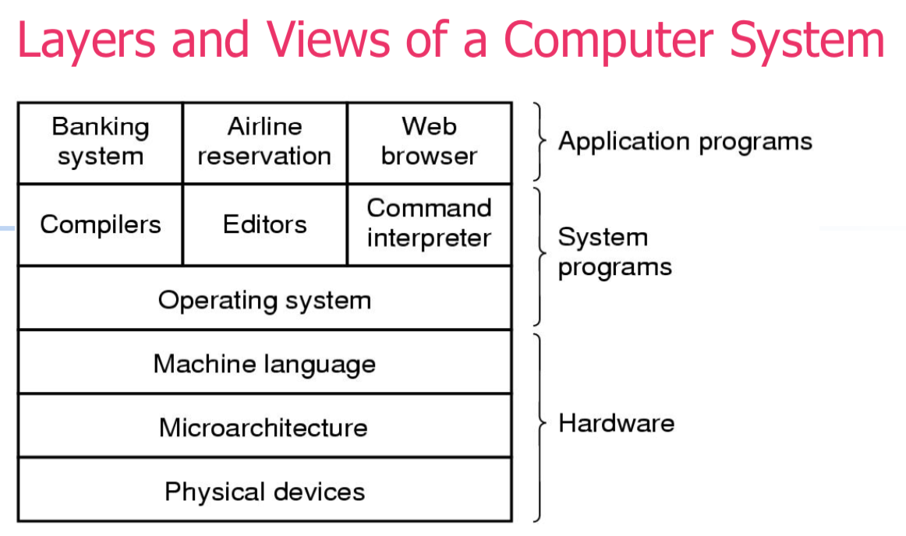
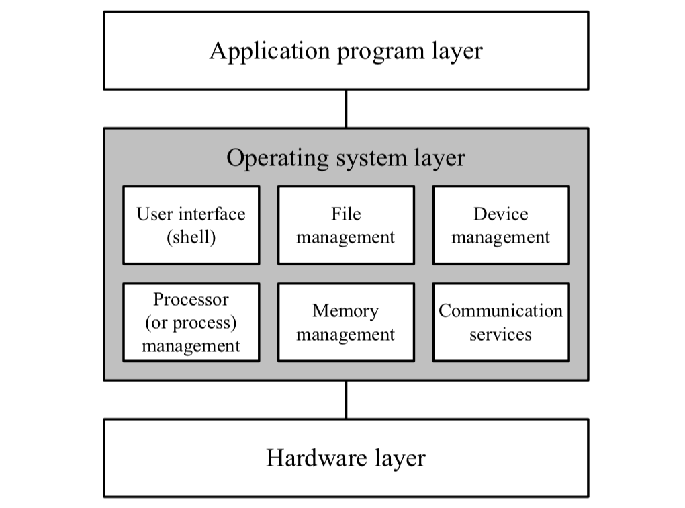
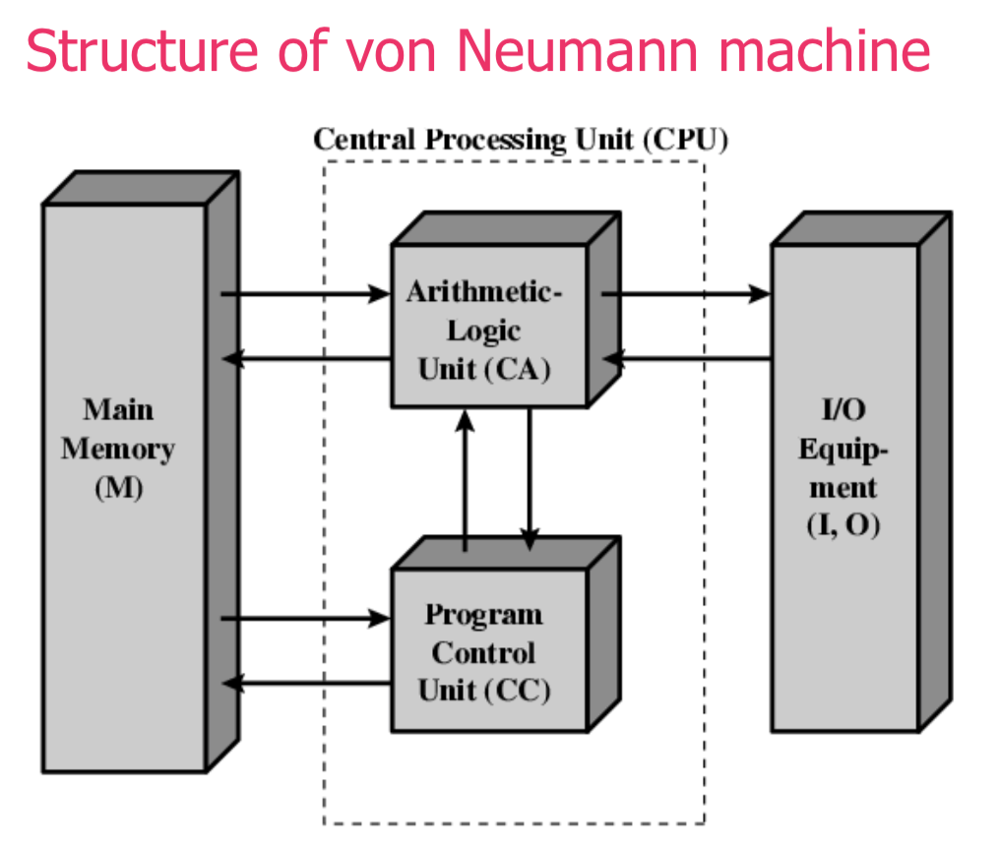

## Objectives
1. To discuss the origins of the operating systems and their subsequent developments
2. To discuss about the generations of computer hardware
3. To know how the Operating Systems is linked with the history and development of various generations of computer systems.

## Introduction
- An operating system is a system software. It may be viewed as an organized collection of software consisting of procedures for operating a computer and providing an environment for execution of programs.
- The OS controls the execution of application programs. It acts as an interface between the user and the computer hardware
- In a nut shell, the OS controls the hardware

## OS Design Constraints
- Performance
- Protection and security
- Correctness
- Maintainability
- Commercial factors
- Standards and open systems

## Operating System
- It is an extended machine
    1. Hides messy details which must be performed
    2. Presents users with a virtual machine, easier to use
- It is a resource manager
    1. Each program gets time with a resource
    2. Each program gets space on a resource
- It is a conductor, the OS coordinates the sharing and use of all the components in the computer. It provides services such as:
    - Resource allocation
    - Scheduling
    - IO control
    - Data management

## Layers and Views of a Computer System

- The bottom layer of the hardware consists of integrated circuits, cathode ray tubes, wires and everything else that electrical engineers use to build **physical devices** such as CDROM drives, keyboard etc.
- The next layer of hardware, **microprogramming**, is software that allow communication with physical devices. Software is usually read only. Known as **firmware**.
- **Machine language** layer defines the instruction set that is available to the computer.
- The **operating system** is a layer between the hardware and the software that we use. It allows programmers to access the hardware and provides a layer of abstraction.
- On the top of the stack is the **system software**. This software is not part of the OS

## Primary components of an OS

## OS as a Resource Manager
1. The operating system is a way of providing users with the resources they need at any given time.
2. Other resources have a layer of abstraction placed between them and the physical resource.
3. An example, of this is a printer. If your program wants to write to a printer, the operating system will take the print requests and spool the data to disc. It will then schedule the prints. During this time it will appear to the user and the program as if their prints requests are going to a physical printer.

## OS Services
- Program creation
- Program execution
- Access to I/O devices
- Controlled access to files
- System access
- Error detection and response
    - Internal and external hardware errors (memory error, device failure)
    - Software errors (arithmetic overflow, segmentation fault)
    - Operating system cannot grant request of application
    - Accounting (collect statucs, monitor performance)

## Kernel
- Portion of OS that is in main memory
- Contains most-frequently used functions such as I/O management, task scheduling, error handling, and program execution functions
- The innermost layer of the OS closest to the hardware, controls the hardware
- Heart of the OS, also called a nucleus
- Main difference between an OS and a system software is that the OS runs in kernel (or supervisor) mode; system software runs in user mode. This means that the OS stops user programs from directly accessing the hardware

## History of OSes
### Zeroth Generation
- Charles Babbage, an English mathematician, designed the first machine (Analytical Engine – First Digital Computer) that incorporated memory.
- It had a mechanical design where wheels, gears, cogs, etc were used. As this computer was slow and unreliable, this design could not really become very popular. There was no question of any Operating System of any kind for this machine.
- Lady Ada Lovelace (daughter of Lord Byron) wrote the instruction for the machine, unfortunately it was never built

### First Generation
- Computers were built with vacuum tubes – electronic valves which control the flow of electricity. Electronic tubes were made of glass tubes with circuits inside. Each computer contained a large number of valves. Input was written in punch card. The memory was made of magnetic ring.
- The language used for programming was machine code consists of 0s and 1s (machine language).
- First generation computers filled entire rooms with thousands of vacuum tubes. Like the analytical engine they did not have an operating system, they did not even have programming languages and programmers had to physically wire the computer to carry out their intended instructions. The programmers also had to book time on the computer as a programmer had to have dedicated use of the machine.
Examples:
- ENIAC (Electronic Numerical Integrator and Computer) developed by John Presper Eckert.
- In 1945 John von Neumann designed the Electronic Discrete Variable Automatic Computer (EDVAC) and the UNIVAC I (Universal Automatic Computer), built by Remington Rand in 1951.

#### ENIAC
- Build by the US – One of the 1st totally electronic valve driven, digital computers
- Could do 100 000 calculations a second.
- Each digit represented by a ring of 10 vacuum tubes. Decimal (not binary), 5,000 additions per second
- Programmed manually by switches

### Second Generation
- Computers built with transistors
§ Could handle interpreters such as FORTRAN or COBOL – English like commands (high-level languages) and much more flexible in their applications.
- Still relied on punched cards for input and printouts for output.
- Programs were submitted on punched cards that were placed onto a magnetic tape. This tape was given to the operators who ran the job through the computer and delivered the output to the expectant programmer.

### Disadvantages:
#### First Generation Computers
- Overheating and burnt out after a while
- Need to replace the components frequently.
- Cumbersome, difficult to use and maintain § Extremely expensive
#### Second Generation Computers
- Size of computer still large and expensive
- Communication was slow
- I/O device was slow because the computer waiting for cards to be read or reports to be printed

### Third Generation
- Computer manufacturers begin replacing transistors with integrated circuits
- Instead of punched cards and printouts, users interact with computers through keyboards, monitors and OS, which allowed the device to run many different applications at one time with a central program that monitored in the memory
- Computers became accessible to a mass audience because they were smaller and cheaper than their predecessors.
- Computers with Multiprogramming and spooling facilities were introduced.

#### Multiprogramming and Spooling
- Up until this time, computers were single tasking. The third generation saw the start of **multiprogramming**. That is, the computer could give the illusion of running more than one task at a time. Being able to do this allowed the CPU to be used much more effectively. When one job had to wait for an I/O request, another program could use the CPU.
- The concept of multiprogramming led to a need for a more complex operating system. One was now needed that could schedule tasks and deal with all the problems that this brings .
- In implementing multiprogramming, the system was confined by the amount of physical memory that was available (unlike today where we have the concept of virtual memory).
- Another feature of third generation machines was that they implemented **spooling**.
- This allowed reading of punch cards onto disc as soon as they were brought into the computer room. This eliminated the need to store the jobs on tape, with all the problems this brings.Similarly, the output from jobs could also be stored to disc, thus allowing programs that produced output to run at the speed of the disc, and not the printer.

### Fourth Generation
- The late seventies saw the development of Large Scale Integration (LSI). This led directly to the development of the personal computer (PC). These computers were (originally) designed to be single user, highly interactive and provide graphics capability.
- It is still (largely) true today that there are “mainframe” operating systems (such as Virtual Machine Environment -VME which runs on ICL mainframes) and “PC” operating systems (such as MS-Windows and UNIX), although the distinctions are starting to blur. For example, you can run a version of UNIX on ICL’s mainframes and, similarly, ICL were planning to make a version of VME that could be run on a PC.
- Some people would argue that the fourth generation actually started in 1971 with the introduction of LSI, then VLSI (Very Large Scale Integration) and then ULSI (Ultra Large Scale Integration).

### Fifth Generation
- The computer generations that each have been influenced by new hardware that was developed (vacuum tubes, transistors, integrated circuits and LSI). The fifth generation of computers may be the first that breaks with this tradition and the advances in software will be as important as advances in hardware. One view of what will define a fifth generation computer is one that is able to interact with humans in a way that is natural to us. No longer will we use mice and keyboards but we will be able to talk to computers in the same way that we communicate with each other. In addition, we will be able to talk in any language and the computer will have the ability to convert to any other language. Computers will also be able to reason in a way that imitates humans.
- Just being able to accept (and understand!) the spoken word and carry out reasoning on that data requires many things to come together before we have a fifth generation computer. For example, advances need to be made in AI(Artificial Intelligence) so that the computer can mimic human reasoning. It is also likely that computers will need to be more powerful. Maybe parallel processing will be required.

## Von Neumann Machines
- In 1945, John Von Neumann designed the EDVAC (Electronic Discrete Variable Automatic Computer) which had a memory. This memory was used to store programs and data. It also consists of CPU and an I/O system.
- The CPU coordinates all the functions in the computer.
- Virtually all-computers are based on concepts developed by John Von Neumann machine.

### Characteristics
- Stored Program concept
- Main memory stores Instructions and data
- ALU operating on binary data (Arithmetic and Logic operations on data).
- The Control unit fetches and interprets the instructions in memory and causes them to execute.
- Input and output equipment operated by control unit

## Simple Batch Systems
- Resident Monitor program
- Users submit jobs to operator
- Operator batches jobs
- Monitor controls sequence of events to process batch
- When one job is finished, control returns to Monitor which reads next job
- Monitor handles scheduling
