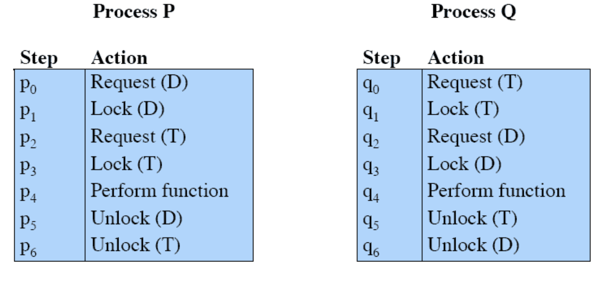
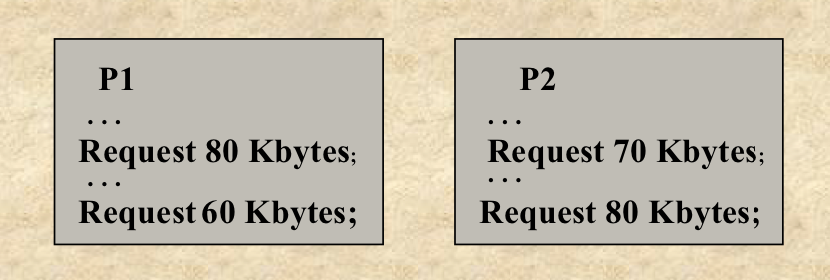
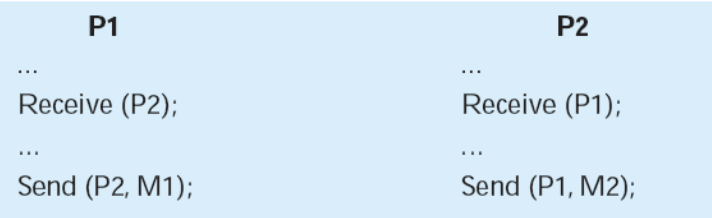
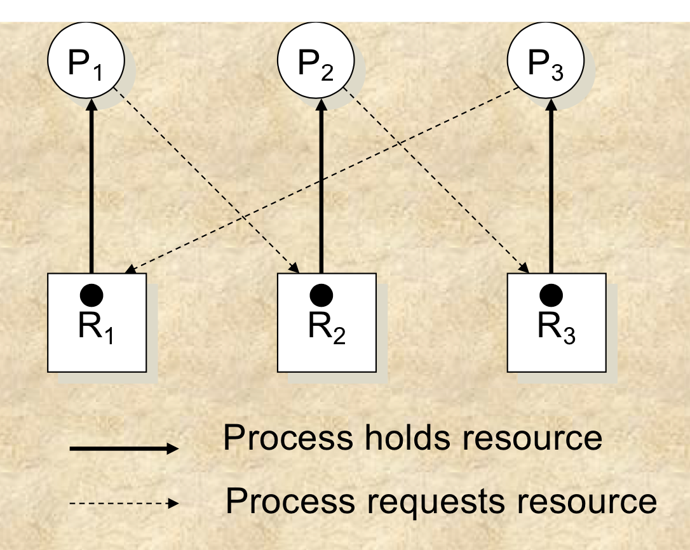
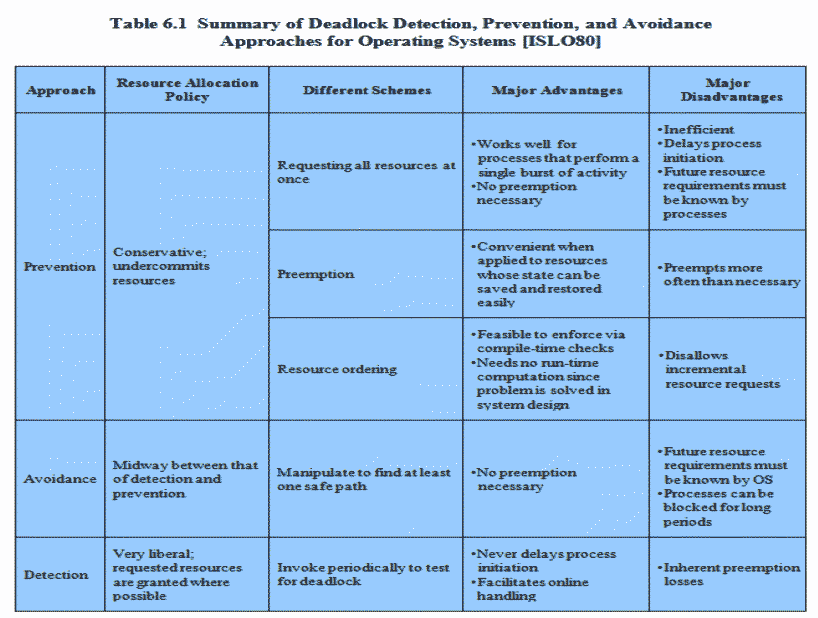

## Objectives
- Deadlocks
- Modeling Deadlocks using Directed Graphs
- Conditions for Deadlocks
- Deadlocks - Detection and Recovery
- Banker's Algorithm

## Deadlock
- Deadlock is:
  - a situation in which one or more processes are waiting for an event that will never occur
  - a situation where a processe is waiting for an event that can only be triggered by another blocked process

## Resource Categories
### Resuable
- Can be safely used by one process at a time and is not depleted by that use:
  - Processors
  - IO Channels
  - Main and Secondary Memory
  - Devices
  - Data structures
    - Files
    - Databases
    - Semaphores

### Consumable
- One that can be created (produced) and destroyed (consumed)
  - Interrupts
  - Signals
  - Messages
  - Information
  - IO buffers

## Reusable Resource Deadlock

<i>
Figure: Resource Deadlock Example 1
</i>
- Deadlock may occur because when process P locks resource D, and process Q locks resource T, process P may not be able to get resource T anymore, as it is being used by process Q and vice versa
- Hence, both processes cannot perform their functions 

<i>
Figure: Resource Deadlock Example 1
</i>

- Let's say only 200Kbytes of memory is available
- Deadlock occurs if both processes progress to their second request around the same time

## Consumable Resource Deadlock
- Consider a pair of processes, in which each process attempts to receive a message from another process and then send a message to the other process

<i>
Figure: Consumable Deadlock Example
</i>

- Deadlock occurs because receive is blocking

## Modeling Deadlocks using Directed Graphs
- Processes represented by circles
- Resources represented by squares
- If there is a cycle in the graph, then there is a deadlock

<i>
Figure: Directed Graph || Resource Allocation Graphs
</i>

- You can see a cylce in the graph:
  - P1 -> R2 -> P2 -> R3 -> P3 -> R1 -> P1

## Deadlocks Detection and Recovery
- Construct a directed graph
- If cycle is found, we have a deadlock

### Steps to Detect Deadlocks
- For each node N in graph:
  1. Create an empty list and set all nodes as unchecked
  2. Add current node to list and see if it appears more than once in the list; if so finish, it is a loop
  3. From given node see if there are any outgoing branches not checked
    - If so go to 4
    - Else jump to 5
  4. Pick any unchecked outgoing branch at random, mark it as checked and follow it to the new current node and go to (2)
  5. At a dead-end, so remove it and backtrack to the previous node and go to 2. If in 2 we find out this is in the initial node then the graph does not contain any loops; terminate search as there is no deadlock

## Conditions for Deadlocks to happen
- Mutual Exclusion
  - A resource may only be used by one process at a time
- Hold-and-Wait
  - A process may hold allocated resources while awaiting assignment of others
- No Pre-emption
  - No resource can be forcibly removed from a process holding it
- Circular Wait
  - A closed chain of processes exists, such that each process holds at least one resource needed by the next process in the chain

## Methods for handling deadlocks
- Important to ensure that the system will never a deadlock state
- Allow the system to enter a deadlock state and then recover
- Use Ostrich Algorithm
- Used by most OS, including UNIX

## Deadling with Deadlocks
- Prevent the deadlock
  - Adopt a policy that eliminates one of the conditions for deadlocks to happen
- Avoid Deadlock
  - Make the appropriate dynamic choices based on the current state of resource allocation
- Detect Deadlock
  - Attempt to detect the presence of deadlocks and take action to recover

## Ostritch Algorithm
- Ignore the problem and pretend that deadlocks never occur in the system
- Used by most OS
- Reasonable if
  - Deadlocks occur very rarely
  - Cost of prevention is high
- Unix and Windows takes this approach
- Trade off between
  - convenience 
  - correctness

## Deadlock Prevention Strategy
- Design a system in such a way that the possibility of deadlock is excluded
- Two main methods:
  - Indirect:
    - Prevent the occurence of one of the three necessary conditions
  - Direct:
    - Prevent the occurence of a circular wait

## Deadlock Condition Prevention
- Prevent one of these conditions:
  - No Mutual Exclusion
    - If access to a resource requires mutual exclusion, then it must be supported by the OS
  - Hold and wait
    - Processes cannot hold all resources and wait
    - Requires that a process request all of its required resources at one time and block the process until all requests can be granted simultaneously
  - No Pre-emption
    - If a process holding certain resources is denied a further request, that process must release its original resources and request them again
  - Circular Wait
    - Must define a linear ordering of resource types so that there are no circular dependencies of resources

## Deadlock Avoidance
- A decision is made dynamically whether the current resource allocation request will, if granted, potentially lead to a deadlock
- Requires knowledge of future process requests
- Two approaches:
  - Resource Allocation Denial:
    - Do not grant an incremental resource request to a process if this allocation might lead to a deadlock
    - Process Initiation Denial
      - Do not start a process if its demands might lead to deadlock

### Resource Allocation Denial
- Referred to as the banker's algorithm
- State of the system reflects the current allocation of resources to process
  - Safe state is one in which there is at least one sequence of resource allocations to processes that does not result in a deadlock
  - Unsafe state is a state that is not safe to allocate resources

#### Banker's Algorithm
- Based on a bank with a fixed amount of capital that operates on the following principles:
  - No customers will be granted a loan exceeding bank's total capacity
  - All customers will be given a maximum credit limit
  - No customer will be allowed to borrow over the limit
  - The sum of all loan's won't exceed the bank's total capacity
- OS (bank) must be sure never to satisfy a request that moves it from a safe state to an unsafe one
- Check OS slides for examples
- Disadvantages:
  - Multiple instances (multiple posibilities)
  - Each process must  have a priori claim of maximum use
  - When a process requests a resource it may have to wait
  - When a process gets all its resources it must return them in a finite amount of time

#### Deadlock Detection Algorithm
- Available
  - A vector of length m indicates the number of available resources of each type.
- Allocation
  - An n x m matrix defines the number of resources of each type currently allocated to a process
  - Column represents resource and resource represent process.
- Request
  - An n x m matrix indicates the current request of each process
  - If request[i][j] equals k then process P(i) is requesting k more instances of resource type R(j)

- Let Work and Finish be vectors of length m and n, respectively
  1. Initialize: Work = Available
  2. for i = 1..n, if Request(i) == 0, then Finish[i] = true, otherwise Finish[i] = false
  3. Find an index i such that both:
    - Finish[i] == false
    - Request(i) <= Work
    If no such i exists, go to step 5
  4. Work = Work + Allocation(i); Finish[i] = true; go to step 3
  5. If Finish[i] == false, for some i between 1 and n, then the sytstem is in a deadlock state; more precisely, if Finish[i] == false, then P(i) is deadlocked
- Refer to: https://www.geeksforgeeks.org/deadlock-detection-algorithm-in-operating-system/
- A check for deadlock can be made as frequently as each resource request or less frequently
- Advantages:
  - Leads to early detection
  - Algorithm is relatively simple
- Disadvantages:
  - Frequent checks consume considerable processor time

### Recovery from Deadlock
- Resource Preemption
  - Selecting a victim to minimize cost
    - Take a resource from some other process depends on nature of the resource
- Rollback:
  - Checkpoint a process periodically
  - Use this saved state when deadlocked
  - Starvation may occur:
    - Same process may always be picked as victim, so include number of rollbacks in cost factor
- Recovery through killing porcess
  - Simplest way to break a deadlock
  - Kill one of the processes in the deadlock cycle
  - The other processes get its resources
  - Choose processes that can be rerun from the beginning without problems

### Summary

<i>
Figure: Summary of approaches
</i>
- Deadlock:
    - The blocking of a set of processes that either compete for system resources or communicate with each other
- Blockage is permanent unless OS takes action
- May involve reusable or consumable resources
    - Consumable:
      - Destroyed when acquired by a process
    - Reusable
      - Not depleted/destroyed by use
- Dealing with deadlocks:
  - Prevention:
    - Guarantees that deadlock will not occur
  - Detection:
    - OS checks for deadlock and takes action
  - Avoidance
    - Analyzes each new resource request