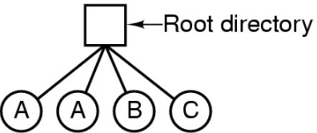
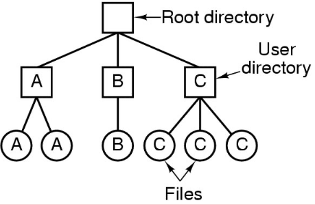
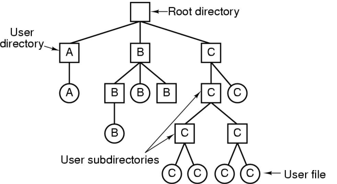
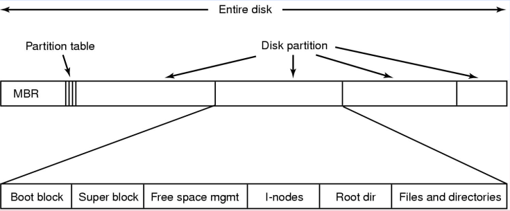
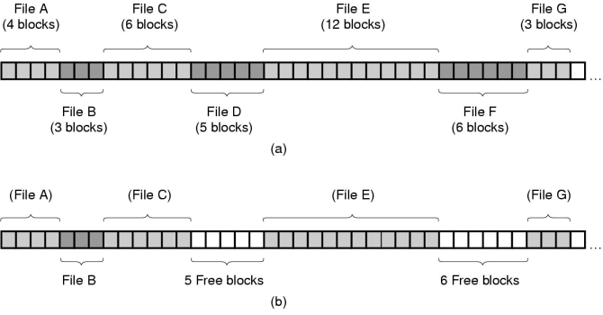
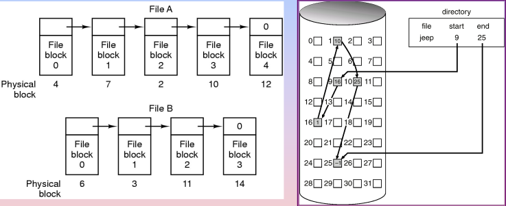
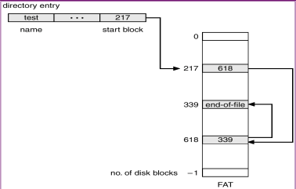
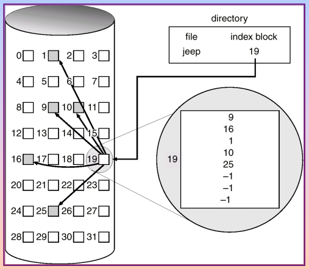

## Objectives
- The File Manager
- Interacting with the File Manager
- File Organization
- Physical Storage Allocation
- Access Methods
- Sharing in File Management Systems

## The File Manager
- Final Manager controls every file in a system
- Efficiency depends on:
  - How system's files are organized
  - How they are stored
  - How each file's records are structured
  - How access to these files are controlled

## Directories
### Single-Level Directory Systems

<i>
Figure: Single Level Directory Systems
</i>
- A single level directory system
  - Contains 4 files
  - Owned by 3 different people, A, B, and C
  - Has naming and grouping problem

### Two-Level Directory Systems

<i>
Figure: Two Level Directory Systems
</i>
- Letters indicate owners of the directories and files
- Can have the same file name for different users
- Efficient searching
- No grouping capability

### Hierarchical Directory Systems

<i>
Figure: Hierarchical Directory Systems
</i>

## Criteria for File Organization
- Rapid Access
  - Needed when accessing a single record
  - Not needed for batch mode
- Ease of update
- Economy of storage
  - Should be minimum redundancy in data
  - Redundancy can be used to speed access such as an index
- Simple maintenance
- Reliability

## Possible File System Layout

<i>
Figure: Possible File System Layout
</i>
- Sector 0 of a disk is the Master Boot Record (MBR)
  - Used at boot
- Partition Table
  - Start and end address of each disk partition
- One partition is active
  - The boot block and loads up the OS
- Superblock
  - Contains all the key file system parameters

## Methods for File Allocation
- An allocation method refers to how disk blocks are alloced for files:
  - [Contiguous Allocation](#contiguous-allocation)
  - Linked Allocation
  - Indexed Allocation

### Contiguous Allocation
- Each file occupies a set of contiguous blocks on the disk
- Simple
  - Only need to keep track of starting location (block number) and length (number of blocks)
- Random access available
- Wasteful of space
- Files cannot grow

<i>
Figure: Contiguous Allocation
</i>
a. Contiguous allocation of disk space for 7 files 
b. State of the disk after D and E have been removed 
- Keeps track of start block and length in a file allocation table
- If a lot of wasted space in between files, use compaction to reduce wasted space

### Linked Allocation

<i>
Figure: Linked Allocation
</i>
- Each file is stored as a linked list of disk blocks
  - Blocks may be scattered anywhere on the disk
- Simple
  - Need only starting address
- Free-space management system
  - No waste of space
- No random access

## File-allocation Table (FAT)

<i>
Figure: File Allocation Table (FAT)
</i>
- Simple but efficient method of disk-space allocation used by MS-DOS and OS/2
- Allocation is on the basis of individual blocks
- Each block contains a pointer to the next block in the chain
- Only single entry in the file allocation table
- Starting block and length of file is available
- No external fragmentation
- Best for sequential files

## Indexed Allocation

<i>
Figure: Indexed Allocation
</i>
- File allocation table contains a seperate one-level index for each file
- The index has one entry for each portion allocated to the file
- The file allocation table contains block numbers for the index
- Need index table
- Random Access
- Dynamic access without external fragmentation
- Overhead of index block

## Inodes
- Unix files have a unique number known as the inode number
- Each file on a disk is represented by an inode structure that occupies an entire disk block
- The inode number is just the address of the block for that file
- The file system reserves enough blocks in a contiguous group
- There is also a bit-vector which indicates which inodes are in use
- An active  inode is associated with exactly one file
- Each file is controlled by exactly one inode
- In many UNIX systems, inodes are kept at the start of the disk
- An alternative method is to allocate an inode when a file is created and put the inode at the start of the first block of the file
  - Advantages:
    - No disk space is wasted on unused inodes
    - Not possible to run out of inodes
    - Less disk movement is needed since the node inode and the initial data can be read in one operation
  - Disadvantages
  - Directory entries will now need to read a 32-bit disk address instead of a 16 but inode number
  - An entire disk will be used even for files, which contain no data
  - File system integrity checks will be slower
  - Files whose size have been carefully designed to fit the block size will no longer fit the block size due to the inode, messing up performance

## Links
### Soft Links (Symbolic links)
- A directory entry containing the path anme for another file
- If the original file is deleted, the link remains, but is broken
- The file system locates the target of the soft link by traversing the directory structure using the specified pathname
### Hard Links
- A directory entry that specifies the location of the file on the storage device
- The file system locates a hard link's file data by directly accessing the physical block it references
### Attributes
|Hard Links|Soft Links|
|:-|:-|
|Efficient|Improves usability by indicating actual file names|
|Do not contain other file names|Less efficient|
|Hard to link to a directory, may lead to circular lists||
|Linux does not allow creating hard links to directories||
### Advantages and Disadvantages
- Hard links do not require any extra space, just a counter in the inode to keep track how many there are
- Symbolic links need space to store the name of the files pointed to
- Symbolic links can point to files on other machines, even over the Internet
- Hard links are restricted to files within their own partition