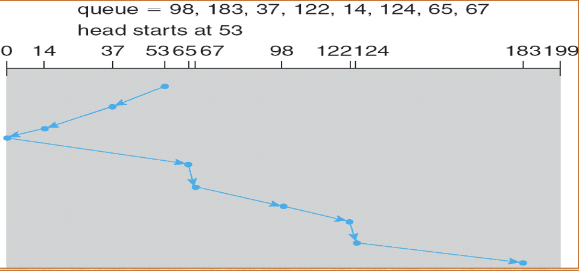

## Objectives

## Disk Storage

<i>
Figure: Disk Storage
</i>
- Magnetic disks provide bulk of secondary storage for computers
  - Drives rotate around 60 to 200 times per second
  - Transfer rate:
    - Rate at which data flows between the drive and the computer
  - Head crash:
    -  Results from disk head making contact witht he disk surface
- Contains:
  - Boot block
  - Super block
  - Free space management
  - Inodes
  - Root directory
  - Files
  - Sub directories

## Disk Performance Parameters
- Disk Structure:
  - Sector 0 is the first sector of the first track on the outermost cylinder
  - Mapping proceeds in order through that track, then the rest of the tracks in that cylinder, and then through the rest of the cylinders from outermost to innermost
- Access time:
  - Seek time is the time for the disk arm to move the heads to the cylinder containing the desired sector
  - Rotational latency is the additional time waiting for the disk to rotate the desired sector to the disk head
- Goal is to minimize seek time

## Disk Scheduling
### First In First Out
- Simplest form of scheduling
- Processes items from the queue sequentially
- Strategy has the advantage of being fair, because every request is honored
- May be slow, because disk head may be jumping around

<i>
Figure: First In First Out
</i>

### Shortest Service Time First (SSTF)
- AKA Closest Cyinder Next
- Select the disk request that requires the least movement of the disk arm from its current position
- Always chooses minimum seek time

<i>
Figure: Shortest Seek Time First
</i>

### SCAN
- AKA elavator program
- Arm moves in one direction only
  - Satisfies all outstanding requests until it reaches the last track in that direction, then the direction is reversed
- Favors jobs whose requests are for tracks nearest to both innermost and outermost tracks

<i>
Figure: SCAN
</i>

### C-SCAN
- Restricts scanning to one direction only
- When last track has been visited in one direction, the arm is returned to the opposite end of the disk and the scan begins

<i>
Figure: C-SCAN
</i>

## LOOK
- The LOOK algorithm is the same as the SCAN algorithm in that it also honors requests on both sweep direction of the disk head
- However, this algorithm "Looks" ahead to see if there are any requests pending in the direction of head movement
- If no requests are pending in the direction of head movement, then the disk head traversal will be reversed to the opposite direction and requests on the other direction can be served

## C-LOOK
- An effort to remove the bias in LOOK for track clusters at the edges of the platter. C-LOOK basically only scans in one direction
- Either you sweep from the inside out, or the outside in
- When you reach the end, you just swing the head all the way back to the beginning
### From Wikipedia
- This actually takes advantage of the fact that many drives can move the read/write head at high speeds if it's moving across a large number of tracks (e.g. the seek time from the last track to track 0 is smaller than one would expect and usually considerably less than the time it would take to seek there one track at a time)
- The huge jump from one end request to the other is not considered as a head movement as the cylinders are treated as a circular list.

<i>
Figure: C-LOOK
</i> 

<i>
Figure: Comparison of Disk Scheduling Algorithms
</i>

## Sector Sparing
- Used to handle bad blocks (forwarding)
- The controller maintains a list of bad blocks on the disk
- The disk is initialised during the low-level formatting at the factory and is updated over the life of the disk
- The low-level formatting also sets aside spare sectors not visible to the operating system
- The controller can be told to replace each bade sector logically with one of the spare sectors
- This scheme is known as spector sparing or forwarding

## Sector Slipping
- Alternative to sector sparing
- Some controllers can be instructed to replace a bad block by sector slipping
- The replacement of a bad block generally is not totally automatic, because data in the bad block are usually lost
- Several soft errors could trigger a process in which a copy of the block data is made and the block is spared or slipped

### Sector Sparing vs Sector Slipping
- https://www.answers.com/Q/What_is_the_difference_between_sector_slipping_and_sector_sparing

## IO Processor

<i>
Figure: IO Processor
</i>

## Techniques for Performing IO
- Programmed IO
- Interrupt Driven IO
- Direct Memory Access (DMA)

||No Interrupts|Use of Interrupts|
|:-|:-|:-|
|IO to memory transfer through processor|Programmed IO|Interrupt-driven IO
|Direct IO to memory transfer|-|Direct Memory Access (DMA)|

## Programmed IO
- If any computer system IO operations are completely controlled by the CPU then it is called as Programmed IO
- CPU has direct control over IO
  - Sensing status
  - Read/write commands
  - Transferring Data
- CPU waits for IO module to complete operation
- Wastes time

## Interrupt Driven IO
- CPU issues read command
- IO module gets data from peripheral whilst CPU does other work
- IO module interrupts CPU
- CPU requests data
- IO module transfers data
- Overcomes CPU waiting
- No repeated CPU checking of device

## Direct Memory Access
- DMA improves data transfer between memory and IO devices
  - Devices and controllers transfer data to and from main memory directly
  - Processor is free to execute software instructions
  - DMA channel uses an IO controller to manage data transfer
    - Notifies processor when IO operation is complete
  - Improves performance in systems that perform large numbers of IO operations

<i>
Figure: Direct Memory Access
</i> 

<i>
Figure: Comparison of Techniques for Input of a Block of Data
</i> 

## Summary
- IO architecture is the computer system's interface to the outside world
- IO functions are generally broken up into a number of layers
- A key aspect of IO is the use of buffers that are controller by IO utilities rather than by application processes
- Buffering smoothes out the difference between the speeds
- Use of buffers also decouples the actual IO transfer from the address space of the application process
- Disk IO has the greatest impact on overall system performance
- Two of the most widely used approaches are disk scheduling and disk cache
