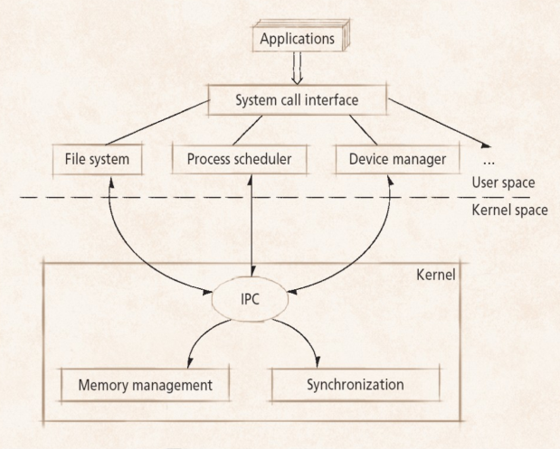
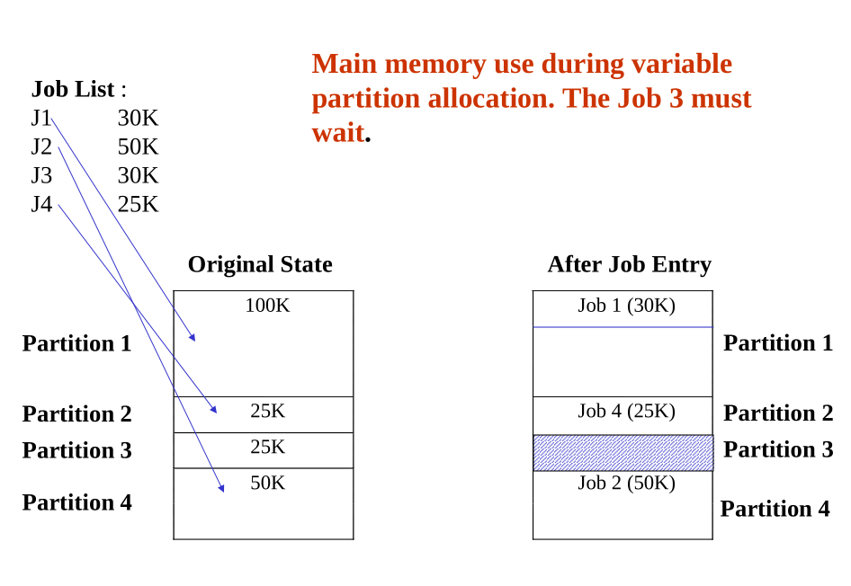
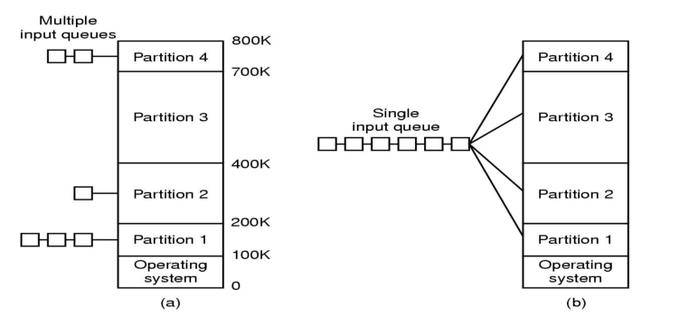
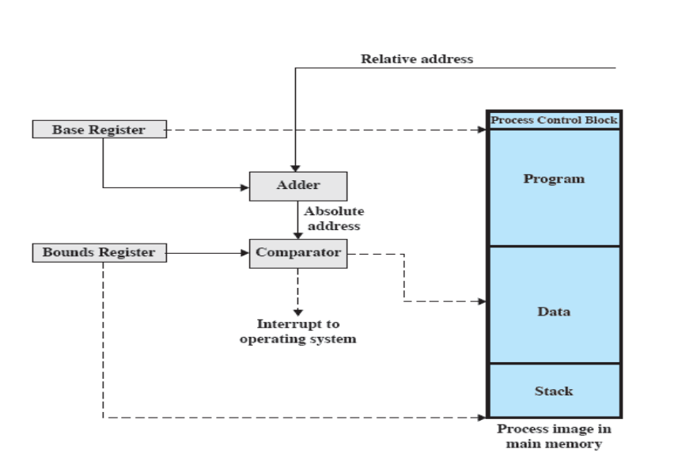
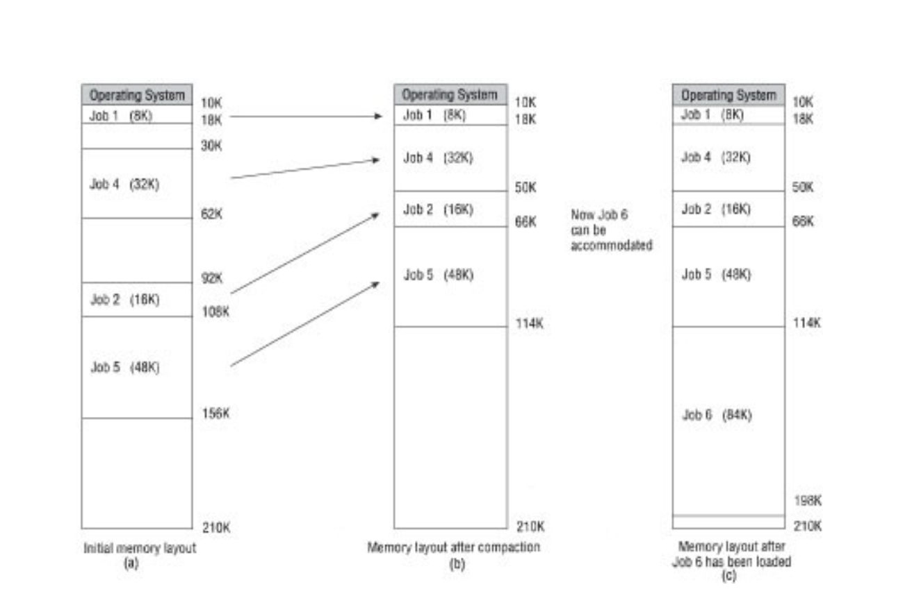
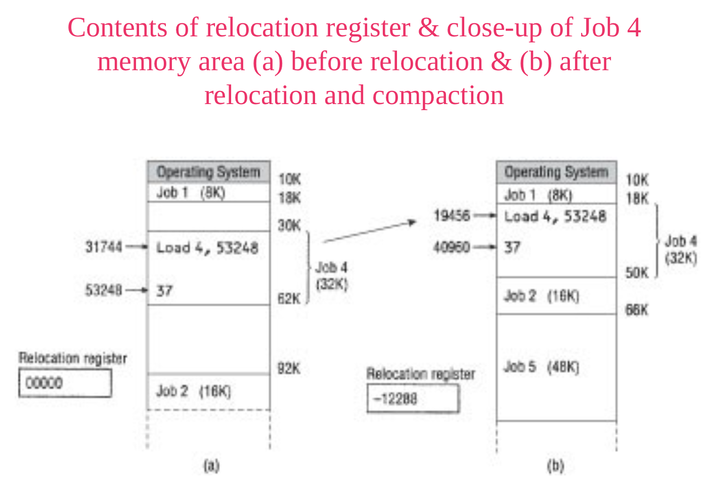

# Objectives
- To discuss how operating systems are organized:
  1. various contiguous and non-contiguous memory allocation schemes
  2. how these memory schemes are implemented
  3. the relocatable dynamic partitioning scheme
  4. dynamic storage-allocation

## OS Structures
### Monolithic Systems
- No structure at all
- Modules of OS are not organized in a well-defined manner and modules can call any other modules without any major restrictions
- OS is simply a collection of procedures
- OS is constructed by compiling all the procedures into one huge monolithic system but they can naturally fall into a structure
- OS can distinguish between *user mode* and *system mode* while executing programs
- An application program is run in *user mode*. When it makes a system call, the OS traps the system call and executes it in system mode.
- Once the execution of the system call is complete, the execution of the application program resumes in the user mode.
- Highly efficient
- Difficult to determine source of subtle errors

## MS-DOS and UNIX System Structure
### MS-DOS
- Provide the most functionality in the least space
- Not divided into modules
- Has some structure, but its interfaces and levels of functionality are not well separated.

### UNIX
- Limited by hardware functionality
- The original UNIX had limited structuring.
- The UNIX OS consists of two separable parts:
  1. Systems programs
  2. The kernel

## Layered Approach
- The OS is divided into a number of layers (levels), each built on top of lower layers
- The bottom layer (layer 0) interacts with the hardware
- The highest layer (layer N) provides the user interface to the application programs/users
- With modularity, each layer uses functions (operations) and services from the lower-level layers

### Layers
- Layer 0 (Processor allocation and multiprogramming):
  - Responsible for the multiprogramming aspects of the os
  - Decides which process is allocated to the CPU
  - Deals with interrupts and perform context switches when required
- Layer 1 (Memory and drum management):
  - Concerned with allocating memory to processes
- Layer 2 (Operator-process communication):
  - Deals with inter-process communication and communication between the os and the console
- Layer 3 (IO management):
  - Manages all I/O between devices attached to the computer
  - This includes buffering information from the various devices
- Layer 4 (User programs):
  - The place user programs are stored
- Layer 5 (Operator):
  - The overall control of the system (called the system operator)

## Microkernel System Structure
- Microkernels provide only the most essential OS functions including:
  1. Process management
  2. Low-level memory management
  3. Communication primitives
  4. System programs
- It relies on system programs and user level programs implemented outside the kernel to provide remaining OS services
- The programs are known as *servers* (File system, process scheduler etc)
  

### Benefits of a microkernel
1. Easier to extend, can add new services without impacting other parts
2. Easier to port to new architectures
3. More reliable (less code running)
4. More secure
5. Possible to build different OS catering to a particular environment using a Microkernel
6. However, the first generation Microkernels were inefficient and slow due to overheads from passing information between applications and servers

## Exokernel
- The Exokernel does not provide abstractions for application programs
- Abstractions such as inter-process communication and virtual memory management are managed by individual applications.
- These applications are referred referred as Library Operating Systems (example: LibOS)

## Virtual Machine
The resources of a physical computer are shared to create VMs:
- CPU scheduling can create the appearance that users have their own processor
- Spooling and a file system can provide virtual I/O
- A normal user time-sharing terminal serves as the VM's machine operator's console

## Memory Management Requirements
A core feature of an OS is to manage the computer's manager:
- Being aware of what parts of the memory are in use
- Allocating and deallocating memory from a process
- Moving data from memory to disk
- Managing hierarchical memory (e.g. volatile cache, RAM, disk storage)

Memory management is intended to satisfy the following requirements:
- Relocation
- Protection
- Sharing
- Logical and physical organization

## Memory Mangement
### Uni-program
- Memory is split into two
- One for the OS (monitor)
- One for the currently executing program

### Multi-program
- User part is sub-divided and shared among active processes
- Several jobs are kept in main memory at the same time, and multiplexed among the cpu

OS features required for Multiprogramming:
- I/O routine
- Memory management
- CPU Scheduling
- Allocation of devices

## Early Memory Management Schemes
1. Single Contiguous
  - Only allow a single process in memory at a time

2. Partitioning
  - Split memory into sections to be allocated to processes (including the OS)
  - Types of partitions:
    1. Fixed-sized partitions
    2. Variable partitions
    3. Dynamic partitions

##  Fixed (static) partitions
1. Equal-size partitions
  - Any process whose size is less than or equal to the partition size can be loaded into an avaialable partition
  - If all partitions are full, the OS can swap a process out of a partition

2. Multiprogramming using fixed partitions
  - One partition for each job
  - Size of partition designated by reconfiguring the system
  - Partitions cannot be too small or large

- Critical to protect a job's memory space
- Entire program is stored contiguously in memory during entire execution
- Main memory use is inefficient
- Any program, no matter how small occupies and entire partition (internal fragmentation), which is inefficient

### Multiprogramming with Fixed Partitions
- Divide the memory into fixed sized partitions
- These partitions can be of different sizes but once a partition's size is allocated, it remains constant
- No provision for size changing

- The memory is divided into four partitions
- When a job arrives it is placed in the input queue for the smallest partition that will accommodate it
- Disadvantages:
  1. As the partitions are fixed, any space not used by a job is lost
  2. Difficult to state how big a partition for a job should be
  3. A job that is placed in a queue may be prevented from running by other jobs waiting
- Solutions:
  1. Use a single input queue for all jobs. When a partition becomes free, search the queue for the first job that fits
  2. Search the queue for largest job that fits in the partition. Less space wasted but smaller jobs neglected. Can create small partition for smaller jobs

## Dynamic Partitioning
- Partitions are variable length and number
- Process allocated as much memory as required
- External fragmentation (Memory not contiguous) will occur
- Solutions:
  1. Coalesce: Join adjacent freed memory into one big block
  2. Compaction: Shuffle memory contents to place all free memory into one block

## Relocatable Dynamic Partitions
- Memory manager relocates programs to gather together all empty blocks
### Relocation
- When programs loaded into memory the actual (absolute) memory locations are determined
- A process may occupy different partitions, meaning different absolute memory locations during execution (from swapping)
### Garbage Collection || Defragmentation
- Free blocks are compacted to make one block of memory that is large enough to accomodate some or all jobs waiting to get in
- Compaction will also cause a program to occupy a different partition, i.e different absolute memory locations

## Types of fragmentation
### External Fragmentation
- Total memory space exists to satisfy a request, but is not contiguous
- Reduce external fragmentation by compaction:
  - Shuffle memory contents to place all free memory together in one large block
  - Compaction is possible only if relocation is dynamic, and is done at execution time

### Internal Fragmentation
- Allocated memory may be slightly larger than requested memory

## Relocation
- No guarantee that process will load into same place in memory every time
- Instructions contain addresses:
  - Location of data
  - Addresses for instructions (branching)
- Physical address: actual location in memory
- Logical address is used instead: relative to beginning of program
- Automatic conversion using base address
- Use base and limit values
  - address locations added to base value to map to physical address
  - address locations larger than a limit value is an error
  

<i>
Figure: Hardware Support for Relocation
</i> 
When a process is assigned to the Running state, the base register is loaded with the starting address in main memory of the program. There is also a "bounds" register that indicates the ending location of the program; these values must be set when the program is loaded into memory or when the process image is swapped in.

<i>
Figure: Memory Before and After compaction
</i> 

## Effects of Multiprogramming

|Use|Uniprogramming|Multiprogramming|
|:-|:-|:-|
|Processor use|22%|43%|
|Memory use|30%|67%|
|Disk use|33%|67%|
|Printer use|33%|67%|
|Elapsed time|30 mins|15 mins|
|Throughput rate|6 jobs/hr|12 jobs/hr|
|Mean response time|18 mins|10 mins|

## Time Sharing
- Using multiprogramming to handle multiple interactive jobs
- Processor's time is shared among multiple users
- Allows multiple users to simultaneously access the system through terminals
- Different scheduling and memory allocation strategies than batch processing
- Tends to propagate processes
- Considerable attention to resource isolation (security and protection)
- Tend to optimize response time

## Batch Multiprogramming vs Time Sharing

||Batch Multiprogramming|Time Sharing|
|:-|:-|:-|
|Principal objective|Maximize processor use|Minimize response time|
|Source of directions to OS|Job control language commands provided with the job|Commands entered at the terminal|
|Usage|Execute multiple programs at a time|Allow multiple users to use the computer|
 

## Resources
- https://stackoverflow.com/questions/37230785/what-is-a-relocation-register#37234435
- https://www.quora.com/What-is-the-difference-between-multiprogramming-and-a-timesharing-operating-system-at-least-7-points