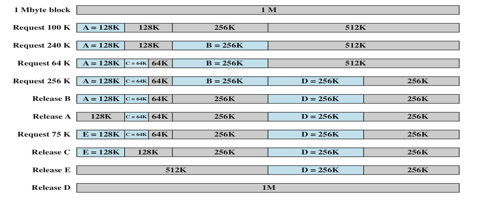

# Lecture 3
## Objectives
- To discuss about the buddy scheme
- To discuss alternatives to the buddy scheme
- To discuss about dynamic memory allocation

## Buddy System
- Memory management scheme that uses variable sized partitions
- Called *buddy* because of the way memory is split into two
- Lists are maintained which store lists of free memory blocks of sizes 1, 2, 4, 8, ..., 2^n, where 2^n is the size of memory (in bytes)
- All memory requests have to be rounded up to a power of two
- Fast but inefficient memory utilization

<i>
Figure: Buddy System
</i>

<i>
Figure: Binary Tree Representation of Buddy System
</i>
- Figure above shows a binary tree representation of the buddy allocation immediately after the Release B request. The leaf nodes represent the current partitioning of the memory. If two buddies are leaf nodes, then at least one must be allocated; otherwise they would be coalesced into a larger block.
- Buddy ssytem is used in parallel systems as an efficient means of allocation and release for parallel programs. A modified form of the buddy system is used for UNIX kernel memory allocation.

## Alternatives to budy system

<i>
(a) and (b): Bit Map Memory Management (c): Linked List Memory Management
</i>
### Memory Management with Bit Maps
Memory is divided into allocation units and each unit has a corresponding bit map:
- If the bit in the bit map is 0, the memory is free
- If the bit is 1, then it is being used

### Memory Management with Linked Lists
Free and allocated memory can also be represented as a linked list:
- P and H for Process and Hole; Starting segment address and the length of the memory segment is given
- The pointer points to the next address
#### Example
If X is the terminating process:
 **a.** Replace the P with a H, others remain same
 **b.** Combine two list entries into one and make the list entry shorter
 **c.** Same as b
 **d.** Combine three entries into one and the list becomes one
 

<i>
Example: Memory Management with Linked Lists
</i>

## Dynamic Partitioning
### External Fragmentation
- Memory becomes more and more fragmented when using dynamic partitioning
- Memory utilization declines

### Compaction
- Used to overcome external fragmentation
- OS shifts processes so that they are contiguous
- Free memory if block is together
- Time consuming and wastes CPU time

## Placement Algorithms
### Best-fit
- Chooses the block that is closest in size to the request

### First-fit
- Scans memory from the beginning and chooses the first available block that is large enough

### Worst-fit
- Scans memory from the beginning and chooses the largest block
- Searches the entire list
- Produces the largest leftover hole

### Next-fit
- Similar to first-fit
- Begins scanning from the location of the last placement and chooses the next available block that is large enoough

### Quick-fit
- Maintains a seperate list for some of the more common sizes required