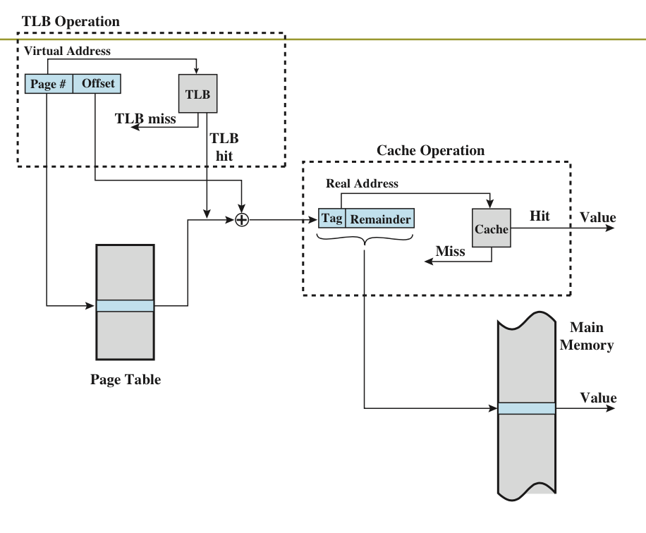

# Lecture 4
## Objectives
- Explain the concepts of paged memory allocation
- Describe the benifits of a virtual memory system
- Explain the concepts of demand paging, page-replacement algorithms, and allocation of page frames
- To explain the concepts of segmented memory allocation

## Paged Memory Allocation Scheme
- Pages refer to logical (virtual) memory
- Frames refer to physical memory
- Page size is usually equal to frame size
- Main memory is called **paged frames**

### How does it work?
- Before executing a program, the memory manager:
  1. Determines number of pages in program
  2. Locates enough empty page frames in main memory
  3. Loads all of the program's pages into them
- However pages may not be sequential
- A simple base address register will no longer suffice
- Instead, the OS maintains a **page map table** for each process

### Page map table
- A page table shows the frame location for each page of the process
- Within the program, each logical address consists of a page number and an offset within the page
- The logical-to-physical address translation is done by the processor
- Programs are split into equal size pages

<i>
Figure: Example of two jobs paging
</i> 

### Finding address of a given line
- Divide line number by its page size:
  - Quotient: page number
  - Remainder: offset from beginning of page

### Pros and Cons of Paging
- Allows jobs to be allocated in non-contiguous memory locations:
  - Memory is used more efficiently; more jobs can fit
  - Supports time sharing system
- Size of page is crucial (not too small, not too large)
- Bigger overhead
- Reduces, but does not eliminate internal fragmentation

## Demand Paging
- Combination of paging and swapping
- Brings a page into memory only when needed (lazy swapper)
  - Less I/O and memory needed (faster response)
  - More users
- Takes advantage that programs are written in sequence; not all pages are necessary at once
- Demand paging makes virtual memory widely available, i.e gives an impression of almost-infinite physical memory
- However requires use of high-speed direct access storage that can work directly with CPU
- How and when pages are swapped depends on predefined policies

## Valid-Invalid Bit
- With each page table entry, a valid-invalid bit is associated
- During address translation, if valid-invalid bit in page table entry is invalid, then raise a page fault

## Page Fault
- Failure to find a page in memory
- OS then looks at another table to decide:
  - If invalid reference -> abort
  - If just not in memory:
    1. Get empty frame
    2. Swap page into frame
    3. Reset tables
    4. Set validation bit to valid
    5. Restart instruction that caused the page fault

## Tables in Demand Paging
1. Job Table
2. Page Map Table (with 3 new fields)
  - Determines if requested page is already in memory
  - Determines if page contents have been modified
  - Determines if the page has been referenced recently
    - Used to determine which pages should remain in main memory and which should be swapped out
3. Memory Map Table

### What happens if there is no free frame?
- Page replacement: find some page in memory not really in use, swap it out
  - Try to mimize number of page faults
- Same page may be brought into memory several times

## Basic Page Replacement
1. Find location of desired page on disk
2. Find a free frame:
  - If there is a free frame, use it
  - If there is no free frame, use a page replacement algorithm to select a **victim** frame
3. Read the desired page into the free frame
4. Update page and frame tables
5. Continue process

## Page Replacement Algorithms
- Page fault forces choice
  - Which page must be removed
  - Make room for incoming page
- Modified page must first be saved
  - Unmodified page just overwritten
- Minimize page swapping
  - Don't choose often used page
- Page Replacement policy can be local or global

## Page Size
- The smaller the page size, the lesser the amount of internal fragmentation
- However, more pages are required per process, meaning larger page tables
- Large programs in heavy multiprogramming environments require some portion of the page tables of active processes be in virtual memory instead of main memory
- Physical characteristics of most secondary memory devices favor larger page size for more efficient block transfer of data

## Pros and Cons of Demand Paging
|Pros|Cons|
|:-|:-|
|Job is not constrained by physical memory|Requires use of high-speed direct access storage that can work with CPU|
|Use memory more efficiently than previous schemes|Increased overhead caused by tables and page interrupts|

## Thrashing
- A problem with Demand Paging
- An excessive amount of page swapping back and forth between main memory and secondary storage

<i>
Figure: Thrashing causes low CPU utilization
</i>

- Caused by too many processes in too little memory
  - OS spends all its time swapping, no work is done
  - Caused when a page is removed from memory but is called back shortly
  - Can occur across jobs, when a large number of jobs fighting for few number of free jobs
  - Can also occur within a job, e.g in loops that cross page boundaries

## Principle of Locality
- Well-designed programs are generally executed in a small area of their logical memory, although the actual area will shift with time
- This principle shows that it is possible to execute most programs with a small working set
- Programs and data references within a process tend to cluster
- Only a few pieces of a process will be needed over a short period of time
- Therefore it is possible to make intelligent guesses about which pieces will be needed in the future
- Locality explicitly focuses on the parts of the address space that are being used by the program at any given time
- Avoids thrashing

### Locality
- Every process has code and data locality
  - Code tends to execute in a few fragments at one time
  - Tend to references same set of data structures
- Dynamically load/unload currently-used address space fragments as the process executes

## Working set model
- If we allocate enough frames to accomadate its current locality, it will only fault whenever it moves to some new locality
- But if allocated frames are lesser than the size of current locality, process is bound to thrash
### Rationale
- The effect of the choice of what pages to be kept in main memory (as distinct from being paged out to auxiliary storage) is important: if too many pages of a process are kept in main memory, then fewer other processes can be ready at any one time
- If too few pages of a process are kept in main memory, then the page fault frequency is greatly increased and the number of active (non-suspended) processes currently executing in the system approaches zero
- The working set model states that a process can be in RAM if and only if all of the pages that it is currently using (often approximated by the most recently used pages) can be in RAM
- The model is an **all or nothing** model, meaning if the pages it needs to use increases, and there is no room in RAM, the process is swapped out of memory to free the memory for other processes to use.

### High-level language features that could be used to improve locality
- Arrays
  - Increase the amount of spatial locality because data is stored and accessed in sequential virtual address order
- Repetition Statements
  - Repetition statements involve temporal locality, meaning the body of the repetition statement is likely to be repeated in the near future

## Virtual Memory
- Even though only a portion of each program is stored in memory, virtual memory appears to the programs as being completely loaded in main memory during the entirety of their processing time
- Shared programs and subroutines are loaded on demand, reducing storage requirements of main memory
- Virtual memory is implemented through demand paging and segmentation schemes:
  - Seperation of user logical memory from physical memory
  - Only part of the programs need to be in memory for execution
  - Logical address space can therefore be much larger
  - Allows address spaces to be shared by several processes
  - Allows for more efficient process creation
- **For virtual memory to be practical and effective:**
  - Hardware must support paging and segmentation
  - OS must include software for managing the movement of pages and/or segments between secondary memory and main memory

### Advantages of Virtual Memory
- "Unlimited" multiprogramming
- Job's size is no longer restricted to the size of main memory
- Memory used efficiently
- Eliminates external fragmentation (paging)
- Eliminates internal fragmentation (segmentation)
- Allows a program to be loaded multiple times and occupy different memory locations each time
- Allows sharing of code and data
- Facilitates dynamic linking of program segments

### Disadvantages
- Increased hardware costs
- Overhead from handling paging interrupts
- Increased software complexity to prevent thrashing

## Paging
- Each process has its own page table
  - Each page table entry contains the frame number of the corresponding page in main memory

## Reading a word from memory

<i>
Figure: Address Translation in a Paging System
</i>
- When a particular process is running, a register holds the starting address of the page table for that process
- The page number of a virtual address is used to index that table and look up the corresponding frame number
- This is combined with the offset portion of the virtual address to produce the desired real address
- Typically, the page number field is longer than the frame number field

 

<i>
Figure: Two Level Paging System
</i>

- The following figure shows the steps involved in address translation for double paging systems
- The root page always remains in main memory
- The first 10 bits of a virtual address are used to index into the root page to find a PTE in the user page table
- If that page is not in main memory, a page fault occurs
- If that page is in main memory, then the next 10 bits of the virtual address is used to index the user PTE page to find the PTE for the page that is referenced by the virtual address

## Translation Lookaside Buffer
- Each virtual memory reference can cause two physical memory accesses:
  - One to fetch the page table entry
  - One to fetch the data
- To overcome the effect of doubling the memory access time, most virtual memory schemes make use of a special high-speed cache called a translation lookaside buffer

<i>
Figure: Translation Lookaside Buffer
</i>

- Given a virtual address, the processor will first examine the TLB
- If the desired page table entry is present (TLB hit), then the frame number is retrieved and the real address is formed
- Else (TLB miss), the processor uses the page number to index the process page table and examine the corresponding page table entry
- If the "present bit" is set, then the page is in main memory, and the processor can retrieve the frame number from the page table entry to form the real address
- The processor also updates the TLB to include this new page table entry
- Finally, if the present bit is not set, then a page fault occurs

<i>
Figure: Paging with a Translation Lookaside Buffer
</i>

<i>
Figure: Translation Lookaside Buffer and Caching
</i>

- A virtual address will generally be in the form of a page number, offset. First, the memory consults the TLB to see if the matching page table entry is present. If it is, the real address is generated. If not, the entry is accessed from a page table
- Once the real address is generated, which is in the form of a tag and a remainder, the cache is consulted to see if the block containing that word is present
- If so, it is returned to the CPU, else it is retrieved from main memory
- The TLB only contains some of the page table entries so we cannot simply index into the TLB based on page numbers
  - Each TLB entry must include the page number as well as the complete page table entry
- The processor is equipped with hardware that allows it to interrogate simultaneously a number of TLB entries to determine if there is a match on page number

## Segmented Memory Allocation
- A segment is a logical unit, for example:
  - main program
  - subroutine
  - procedure
  - local variables
  - global variables
  - common block
  - stack
  - symbol table
  - array
- Based on common practice by programmers structuring their programs in modules (logical groupings of code)
- Main memory is not divided into page frames because size of each segment is different
  - Memory is allocated dynamically

<i>
Figure: Mapping of segmented address space to physical memory
</i> 

## Segmentation
- Paging is not (usually) visible to the programmer
- Segmentation is visible to the programmer
- Usually different segments allocated to program and data

<i>
Figure: Segmentation Hardware
</i> 

## Segmentation Address Translation by Direct Mapping

<i>
Figure: Segmentation Referencing Process
</i> 

## Segment Map Table
- When a program is compiled, segments are set up according to a program's structural modules
- Each segment is numbered and a Segment Map Table (SMT) is generated for each job
- Contains:
  - segment numbers
  - their lengths
  - access rights
  - status
  - location in memory

<i>
Figure: Segmentation Referencing Process
</i> 

## Advantages of Segmentation
- Simplifies handling of growing data structures
- Allows programs to be altered and recompiled independently, without relinking and reloading
- Can be shared among processes
  - Dynamic libraries
  - Sharing segments can incur less overhead
- Lends itself to protection
  - A common scheme is to use protection bits that specify whether a process can read, write, or execute a segment
- Some systems combine segmentation with paging

## Segmented/Paged Memory Allocation
- Evolved from combination of segmentation and paging
  - Logical benifits of segmentation
  - Physical benifits of paging
- Subdivides each segment into pages of equal size which are smaller than most segments, and more easily manipulated than whole segments
- Eliminates many problems of segmentation because it uses fixed length pages

|Paging|Segmentation|
|:-|:-|
|Main memory partitioned to frames or blocks|Main memory partitioned into segments|
|Logical address space divided into pages by compiler|Logical address space divided into segments|
|Scheme suffers from internal fragmentation or page breaks|Scheme suffers from external fragmentation|
|OS maintains a list of free frames|OS maintains particulars of available memory|
|OS maintains a page map table for mapping between frames and tables|OS maintains a segment map table|
|Scheme does not support the users view of memory|Scheme supports users view of memory|
|Processor sues page number and displacement to calculate physical address|Processor uses segment number and displacement to calculate physical address|
|Multilevel paging possible|Multi level segmentation is possible, but no use|

## Example: Intel Pentium

<i>
Figure: Logical to Physical Address Translation in Pentium
</i>
- Supports both segmentation and segmentation with paging
- CPU generates logical address
  - Given to segmentation unit
    - Produces linear addresses
  - Linear address given to paging unit
    - Physical address generated

## Example: Windows NT
- Uses demand paging with **clustering**
- Clustering brings pages surrounding the faulting page
- Processes are assigned working set minimum and working set maximum
- Working set minimum is the minimum number of pages the process is guaranteed to have in memory
- A process may be assigned as many pages up to its working set maximum.
- When the amount of free memory in the system falls below a threshold, automatic working set trimming is performed to restore the amount of free memory
- Working set trimming removes pages from processes that have pages in excess of their working set minimum

## Example: Solaris 2
- Maintains a list of free pages to assign faulting processes
- Lotsfree: threshold parameter to begin paging
- Paging is peformed by pageout process
- Pageout scans pages using modified clock algorithm
- Scanrate is the rate at which pages are scanned
- This ranges from slowscan to fastscan
- Pageout is called more frequently depending upon the amount of free memory available