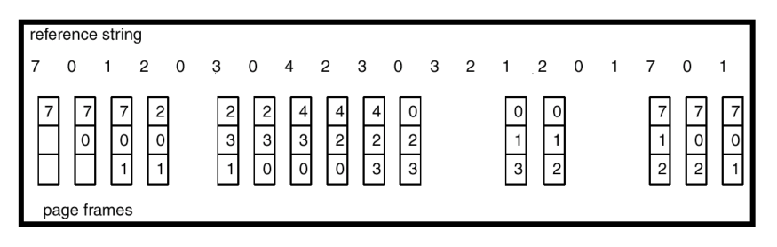
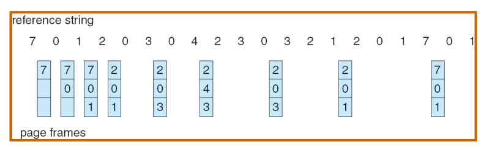
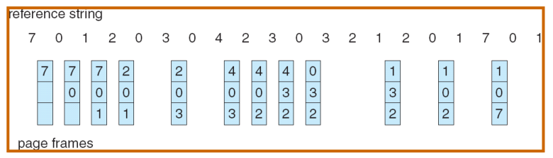
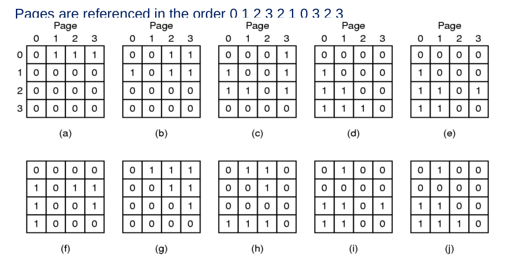
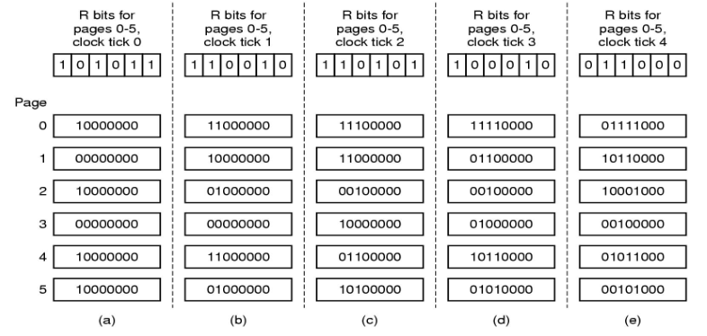
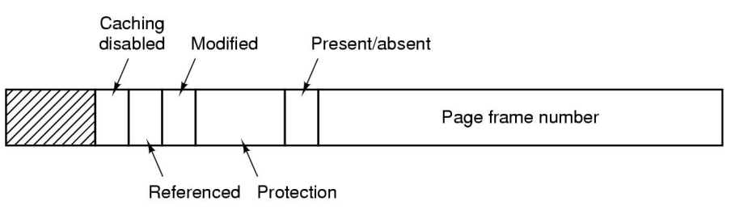

## Objectives
- To describe the various page replacement policies
- To discuss the principle of the working-set-model

## Page Replacement Algorithms
- Page fault forces choice
  - Which page must be removed
  - Make room for incoming page
- Modified page must first be saved
  - Unmodified page just overwritten
- Minimize page swapping
  - Don't choose often used page
- Page Replacement policy can be local or global

## Page Replacement Policies
- [First In First Out](#first-in-first-out)
- [Optimal Page Replacement](#optimal-page-replacement-opr)
- [Least Recently Used](#least-recently-used)
- [Not Recently Used](#not-recently-used)
- [Second Chance Replacement Policy](#second-chance-replacement-policy)

## First In First Out
- Maintain a linked list of all pages
  - In order they came into memory
- Page at beggining of list is replaced
- Disadvantage: page in memory the longest may often be used

<i>
Figure: First In First Out 15 Page Faults
</i> 

### Belady's anomaly
- One might assume that more pages in memory is better in terms of reducing thrashing
- Belady's anomaly shows that increasing page frames may cause more page faults
- Basically, you’re replacing cache faster than you’re getting return on using it

## Optimal Page Replacement (OPR)
- Replace the page that will not be used immediately but in the most distant future
- Difficult for the OS to know about the future behaviour of a process in advance
- Very little practical use; optimal but unrealizable
- Lowest page-fault rate of all algorithms

<i>
Figure: Optimal Page Replacement 9 Page Faults
</i> 

## Least Recently Used
- LRU replaces pages that has not been used for the longest time
- Only slightly better than FIFO
- Throws out a page that has been unused for longest time
- Does not have same anomaly as FIFO (Belady's anomaly)
- Difficult to implement:
  - One approach is to tag each page with the time of last time used
  - However causes big overhead

<i>
Figure: Least Recently Used Replacement 12 Page Faults
</i> 

### LRU Stack Implementation
- Keep a stack of page numbers in a double linked list
- Most recently used at front, least at rear
- If page referenced:
  - Move page to top
  - 6 pointers have to be changed
- No search for replacement

### LRU Counter Implementation
- Keep a counter of number of references that have been made to each page
- When a page needs to be changed, look at counters to determine which to change
- Replaces page with smallest count

### Hardware Implementation of LRU
- If we have n page table entries, we maintain a `n x n` matrix initialized to zero
- When a page frame `k` is referenced then all the bits of the row `k` are set to one
- All the bits of the `k` column are set to zero
- At any time  the row with the lowest binary value is the row that is the least recently used

<i>
Figure: Least Recently Used Hardware Implementation 12 Page Faults
</i> 

### Aging algorithm to simulate LRU
- **NFU Algorithm**: Implementing LRU algorithm in software
- Simulates LRU and implements a system of **aging**

<i>
Figure: Least Recently Used using Aging Algorithm
</i> 

## Not Recently Used
- Each page has a Reference bit and a Modified bit
  - bits are set when page is referenced or modified
- NRU removes pages at random
  - from lowest numbered and non empty class
  - because it is better to remove a modified page that has not been referenced in at least one tick than a clean page in heavy use

||Modified|Referenced|Meaning|Priority|
|:-|:-|:-|:-|:-|
|Case 1|0|0|Not modified AND not referenced|3|
|Case 2|0|1|Not modified BUT was referenced|2|
|Case 3|1|0|Was modified BUT not referenced (impossible?)|-|
|Case 4|1|1|Was modified AND referenced|1|

<i>
Figure: Typical NRU Page Table Entry
</i> 

## Second Chance Replacement Policy
- Modification of the FIFO algorithm
- When a page fault occurs, the page at the front of the linked list is inspected
- If it has not been referenced (reference bit is clear), it is evicted (expelled)
- If reference bit is set, page is placed at the end of the linked list and its reference bit is cleared
- Next page is then inspected
- Worse case
  - SCPR operates same as FIFO
  - For example all reference bits are set
  - Linked list is cycled through and since first entry's referenced bit is cleared, first page chosen

### Clock Page Replacement
- Con of SCRP is that pages are constantly being moved around
- Clock replacement keeps all page frames on a circular list
- When page fault occurs, page being pointed by the hand is inspected
  - If reference bit is 0, the page is evicted
  - If reference bit is 1, reference bit is cleared and hand moves to next item on linked list

## Working-Set Model
### Wikipedia
- The effect of the choice of what pages to be kept in main memory (as distinct from being paged out to auxiliary storage) is important: if too many pages of a process are kept in main memory, then fewer other processes can be ready at any one time. If too few pages of a process are kept in main memory, then the page fault frequency is greatly increased and the number of active (non-suspended) processes currently executing in the system approaches zero.

- The working set model states that a process can be in RAM if and only if all of the pages that it is currently using (often approximated by the most recently used pages) can be in RAM. The model is an all or nothing model, meaning if the pages it needs to use increases, and there is no room in RAM, the process is swapped out of memory to free the memory for other processes to use.

- Often a heavily loaded computer has so many processes queued up that, if all the processes were allowed to run for one scheduling time slice, they would refer to more pages than there is RAM, causing the computer to "thrash".

- By swapping some processes from memory, the result is that processes that were temporarily removed from memory finish much sooner than they would if the computer attempted to run them all at once. The processes also finish much sooner than they would if the computer only ran one process at a time to completion since it allows other processes to run and make progress during times that one process is waiting on the hard drive or some other global resource.

- Working set strategy prevents thrashing while keeping the degree of multiprogramming as high as possible. Thus it optimizes CPU utilization and throughput. 

### Slides
- Goal is to avoid a process from raising page faults every time it is restarted
- In order to do this the paging system has to keept rack of the processes' working set so that it can be loaded into memory before it is restarted
- Working set is the set of pages in memory that can be accessed directly without incurring a page fault
- Main aim to reduce page faults
- A.K.A **prepaging**
- Locality of reference occurs with well-structured program
  - During any phase of its execution, programs only references a small fraction of its pages

- Δ ≡ working-set window ≡ a fixed number of page references
- WSS (working set of Process P) = total number of pages referenced in the most recent Δ (Varies in time)
  - If Δ too small, will not encompass entire locality
  - If Δ too large, will encompass several localities
  - If Δ tends to infinity, will encompass entire program
- System must decide:
  - How many pages comprise the working set
  - What is the maximum number of pages the OS will allow for a working set