## Objectives
- Basic Concepts
- Process Concept
- Process Scheduling
- Process Identification, Process Status, Process State
- Process Control Block
- Scheduling Criteria
- Scheduling Algorithms

## CPU Allocation to Jobs
- Single-user systems:
  - Processor is busy only when user is executing a job, otherwise idle
- Multiprogramming environment
  - Processor must be allocated to each job in a fair and efficient manner 
  - Requires scheduling policy and scheduling algorithm

## Important Terms
1. Program
  - Inactive unit or a unit of work that has been submitted by user
2. Process
  - A task or active entity, which requires a set of resources like CPU and special registers to perform its functions

## Process Elements
1. Program code
2. Data associated with code
 

- While a program is executing, the associated process can be uniquely characterized by a number of elements:
  1. Identifier
  2. State
  3. Priority
  4. Program counter
  5. Memory pointers
  6. Context data
  7. IO status info
  8. Accounting info

## Job Scheduling vs Process Scheduling
- A processor manager has the following:
  - Job Scheduler
    - A job is a unit of work that has been submitted by the user
  - Process Scheduler

## Model of Process Execution
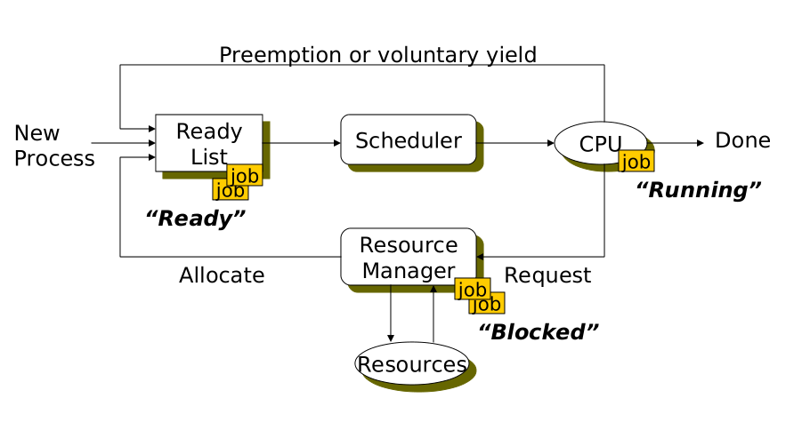
<i>
Figure: Model of Process Execution
</i> 

## Scheduler as CPU Resource Manager
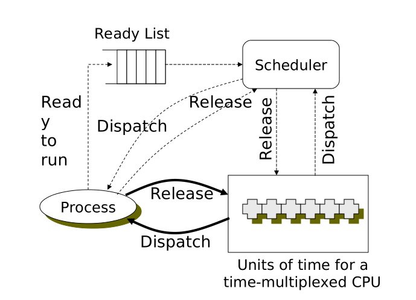
<i>
Figure: Scheduler as CPU Resource Manager
</i>

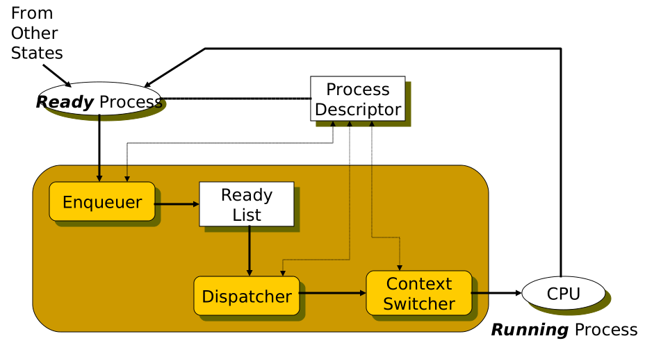
<i>
Figure: Scheduler In Action
</i> 

## IO-bound and CPU-bound jobs
- IO bound jobs
  - Spends more time doing IO than computations
    - e.g Printing documents
- CPU bound jobs
  - Spends more time doing computations
    - e.g Finding the first 300 primes

## Two-State Process Model
- A process may be in one of two states:
  - running
  - not-running
- Running a process is called dispatching
- Stopping a process is called pausing

## Queuing Diagram
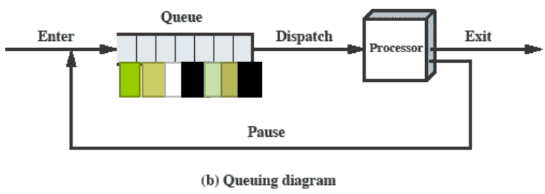

## Five-State Process Model
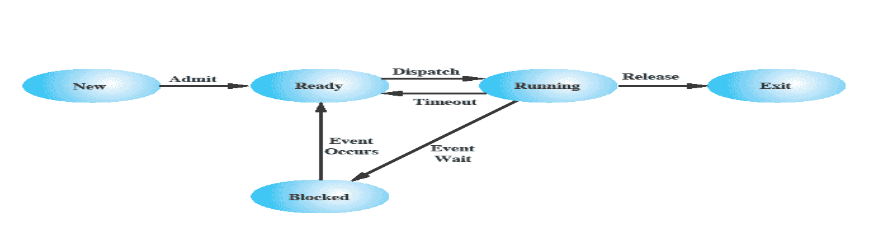
<i>
Figure: Five State Process Model
</i>

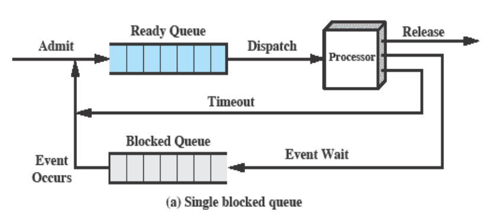
<i>
Figure: Two Blocked Queues
</i>

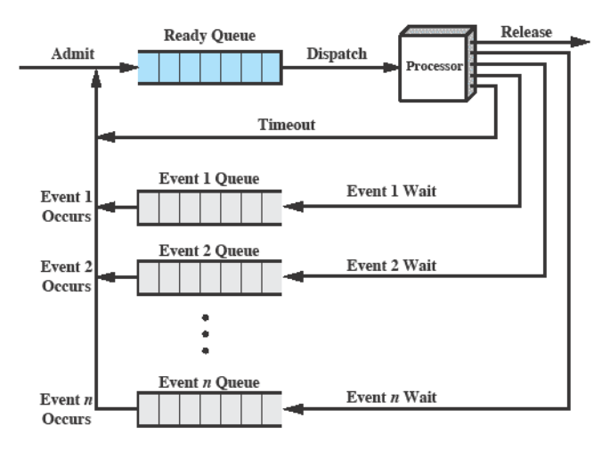
<i>
Figure: Multiple Blocked Queues
</i> 

## Process Control Block
- Data structure that contains basic info about the job
  - Process state
  - Program counter
  - CPU registers
  - CPU scheduling information
  - Memory management information
  - Accounting information
  - IO status information
- Process control blocks are managed by a process table

## Process Scheduling Policies
- Before the OS can schedule all jobs in a multiprogramming environment, it must resolve three limitations in the system:
  - finite resources
  - some resources can't be shared after being allocated (printers)
  - some resources require operator intervention (tape drives)

## Preemptive and Non-preemptive Scheduling
- Preemptive scheduling:
  - Interrupts processing of a job and transfers the CPU to another job
  - Preemption can occur when a new process arrives, on an interrupt or periodically
- Non-preemptive scheduling:
  - Once a job captures the processor and begins execution, it remains in running state uninterrupted until it issues an IO request or until it is finished

## Scheduling Criteria
- CPU utilization
  - Keep CPU as busy as possible
- Throughput
  - Number of processes that complete their execution per unit time
- Turnaround time
  - Time between submission of process and finishing of process
- Waiting time
  - Amount of time a process has been waiting in the ready queue
- Response time
  - Amount of time it takes from when a request was submitted until the first response is produced, not ouput

## Process Scheduling Algorithms
- [First Come First Served](#first-come-first-served)
- [Shortest Job First](#shortest-job-first-sjf)
- [Priority Scheduling](#priority-scheduling)
- [Round Robin](#round-robin)
- [Multilevel Queue Scheduling](#multilevel-queue-scheduling)
- [Highest Response Ratio Next](#highest-response-ratio-next)

## Formulas
- WT = (Time Process Finishes Executing) - BT - AT
- RT = (Time Process Starts Executing) - AT

## First Come First Served
- Non-preemptive
- Handles jobs according to their arrival time
- Good for batch systems, not good for interactive systems
- Turnaround time is unpredictable
- Leads to Convoy Effect (short processes behind long processes)
- Waiting Time = Process Start Time - Arrival Time

## Shortest Job First (SJF)
- Schedule process with shortest CPU burst
- More appropriate term is *Shortest Job Next*
- Services small processes before larger ones
- Is optimal:
  - Minimum average waiting time
  - Only if all jobs arrive at the same time with accurate CPU estimates
- Does not work in interactive systems:
  - Requires advance knowledge of CPU time required to finish each job
- Two schemes:
  - Non-preemptive:
    - Once CPU given to the process it must be completed
  - Preemptive (Shortest Remaining Time First):
    - If a new process arrives with CPU burst length less than remaining time of currect executing process, preempt

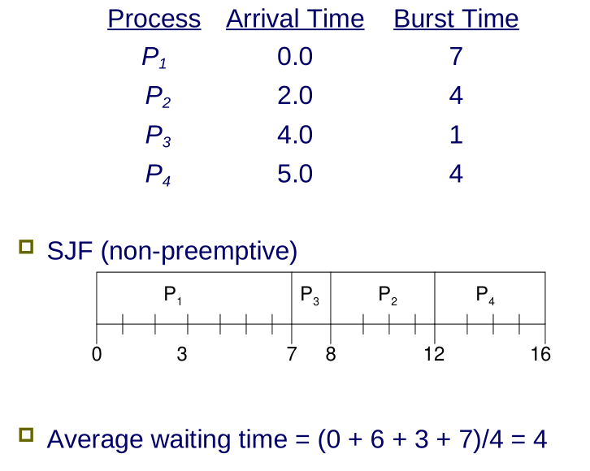
<i>
Figure: Example of non-preemptive SJF
</i>
<b><i>
Waiting Time = Process Start Time - Arrival Time
</i></b> 

## Shortest Remaining Time First
- Preemptive version of SJN
- Processor allocated to job closest to completion
- Job however can be preempted if a newer job in READY queue needs a shorter time to complete
- Cannot be implemented in interactive systems
- More overhead than SJN

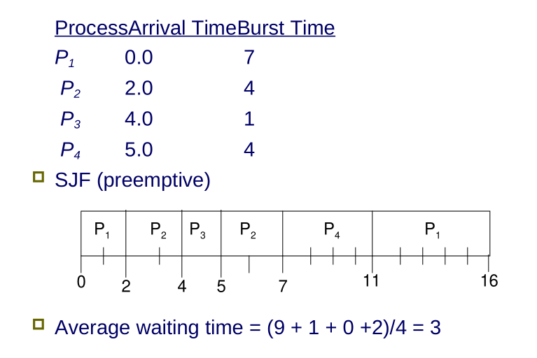
<i>
Figure: Example of preemptive SJF
</i>

## Priority Scheduling
- Gives preferential treatment to important jobs
  - Programs with highest priority are processed first
  - Processes not interrupted until CPU cycles are completed or a natural wait occurs (non-preemptive)
- If two jobs with equal priority are allocated, the one that arrived first is given priority

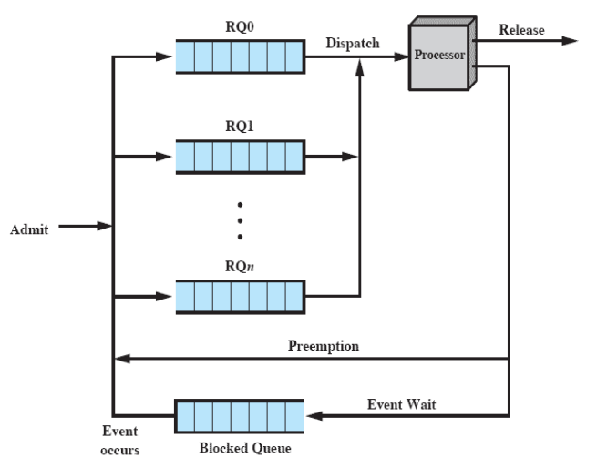
<i>
Figure: Priority Queueing
</i>

- A priority number is associated with each process
- SJF is a priority scheduler where the priority is the predicted next CPU burst
- Starvation may occur, where low priority processes may never execute
- Solution is to use aging, as time progresses, increase the priority of the process

## Round Robin
- Preemptive
- Extensively used in interactive systems because easy to implement
- Based on a predetermined slice of time (time quantum)
- Each process gets a time quantum of about 10-100 milliseconds
- After this time has elapsed, the process is preempted and added to the end of the ready queue

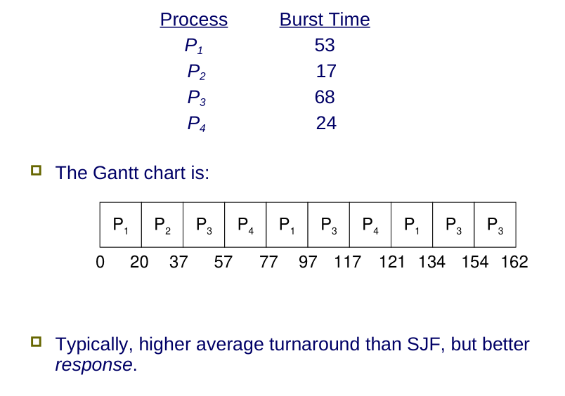
<i>
Figure: Round Robin Example
</i>

## Context Switching
- CPU switches to another process
- The system must save the state of the old process and load the saved state for the new process
- Required by all preemptive algorithms
- Context-switch time is overhead
- The system does no useful work while switching

## Multilevel Queue Scheduling
- Not a seperate scheduling algorithm
- Works in conjunction with other schemes
- Example:
  - Priority-based system with different queues for each priority level
  - Put all CPU-bound jobs in one queue and all IO-bound jobs in another
  - Alternately select jobs from each queue to keep system balanced
  - Put batch jobs in background queue and interactive jobs in foreground queue; with foreground queue more favourable than background

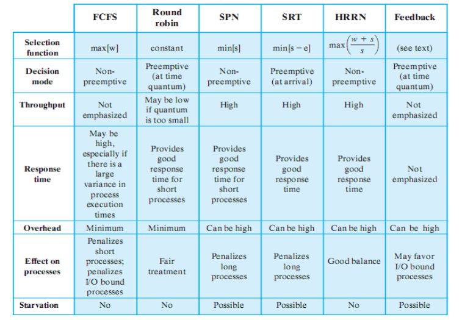
<i>
Figure: Comparison of Various Scheduling Policies
</i>

## Highest Response Ratio Next
- Response ratio = `(WT + BT) / BT`
- Chooses next process with the greatest ratio
- Accounts for the age of the process
- While shorter jobs are favored, aging without service increases the ratio so that longer processes will eventually get CPU time

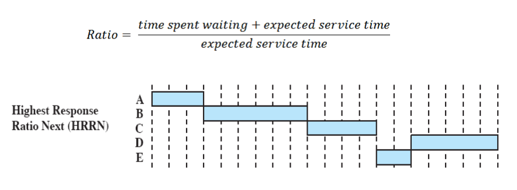
<i>
Figure: Calculating Ratio To Choose Next Job
</i>

## Real-Time Systems
- Correctness of system is important
- Scheduler is important here
- Examples:
  - control of laboratory experiments
  - process control in industrial plants
  - robotics
  - air traffic control
  - telecommunications
  - military command and control systems
- Processes attempt to control or react to events that take place in the real world

### Hard and Soft Real-Time Tasks
|Hard real-time task|Soft real-time task|
|:-|:-|
|Required to complete a critical task within a guaranteed amount of time|Has an associated deadline that is desirable but not mandatory|
|Otherwise will cause damage|Still makes sense to schedule and complete task even when deadline over|

### Characteristics of Real Time Systems
- Deterministic
- Responsive
- Less user control
- Reliable
- Fail-soft operation 
  - If one component fails the whole system does not crash