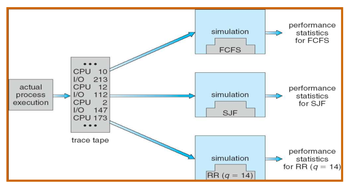
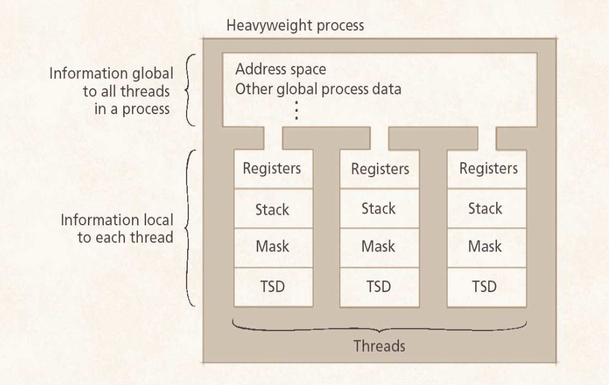
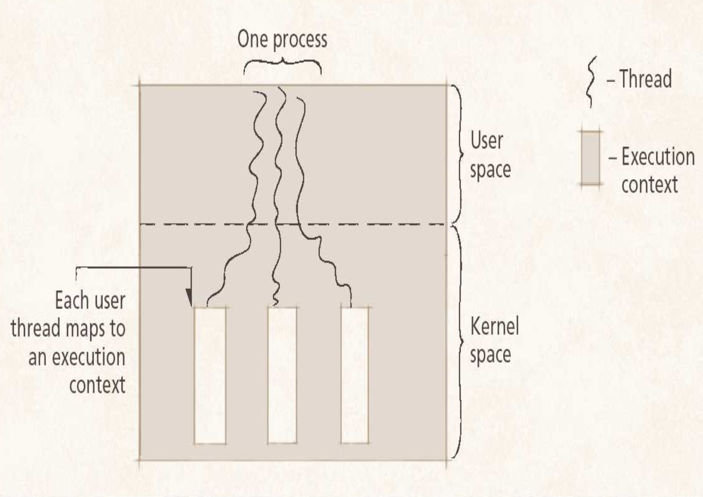

## Objectives
- [Evaluation of Scheduling Algorithms](#evaluation-of-scheduling-algorithms)
- [Threads](#threads)
- [Multithreads](#multithreaded-approaches)

## Evaluation of Scheduling Algorithms
### Deterministic Modelling
- Takes a predetermined workload and evaluates each algorithm
- Advantages:
  - Exact
  - Fast to compute
- Disadvantages:
  - Only applicable to workload that is used to test

### Queueing Models
- Use queuing theory
- Define a queue for the CPU and a queue for each IO device and test the various scheduling algorithms
- A useful formula is Little's Formula:
  - n = ëw
  - n - average queue length
  - ë - average arrival rate for new processes
  - w - average waiting time in the queue
- Major Disadvantage:
  - Difficult to define realistic distribution times and assumptions have to be made

### Simulation

<i><p style="text-align: center;">Figure: Simulation To Model CPU schedulers</p></i><br>

- A variable (clock) is incremented
- At each increment the state of the simulation is updated
- Performance is analysed from simulation
  - Use trace data collected  from real processes on real machines
- Disadvantages:
  - Simulations can take a long time to run
  - Can take a long time to implement
  - Trace data may be difficult to collect and require large amounts of data

## Threads
- A process is divided into a number of light weight processes
- A thread is smaller than a process
- Managed by the OS or a user application


<i><p style="text-align: center;">Figure: Threads' Relationship to Processes</p></i><br>

### Thread creation
- Thread creation use fewer resources than process creation
- Creating a process requires PCB
- The PCB includes a memory map
- Allocating and managing the memory map is typically the most time-consuming activity
- Thread uses a small data structure to hold a register-set, stack and priority

### Processes and Threads
- Per Thread Items:
  - Program Counter
  - Stack
  - Register Set
  - Child Threads
  - State
- Per Process Items
  - Address Space
  - Global Variables
  - Open Files
  - Child Processes
  - Timers
  - Signals
  - Semaphores
  - Accounting Information

### Thread Operations
- Threads and processes have common operations:
  - Create
  - Exit (terminate)
  - Suspend
  - Resume
  - Sleep
  - Wake

## Multithreaded Approaches
- The ability of an OS to support multiple, concurrent paths of execution of execution within a single process
- Each thread will be executed concurrently with other threads

## Examples of Multithreading
- A web server that services each request in a seperate thread
- A parallelized application: Matrix multiplication
- An interactive GUI program:
  - Different threads for different operation:
    - User input
    - Running an application
    - Monitoring performance

## Benifits of multithreading
- Responsiveness
- Resource Sharing
- Economy
- Utilzation of Multi Processor Architectures

## User-level Threads
- User-level threads perform threading operations in user space
  - Threads are created by runtime libraries that cannot execute privileged instructions or access kernel primitives directly
- Advantages:
  - Thread switching does not require kernel mode privileges
  - Scheduling can be application specific
- Disadvantages:
  - When a ULT executes a system call, not only is that thread blocked, but all threads within the process are blocked

## Kernel-level Threads
- Address the limitations of user-level threads by mapping each thread to its own execution context
- Kernel-level threads are not always the optimal solution for multithreaded applications
- Advantages:
  - The kernel can simultaneously schedule multiple threads from the same process on multiple processors
  - If one thread in a process is blocked, the kernel schedule another thread of the same process
- Disadvantages:
  - The transfer of control from one thread to another within the same process requires a mode switch to the kernel

<i><p style="text-align: center;">Figure: Kernel Threads</p></i><br>

## Multithreading Models
### Many-to-One
- OS maps all threads in a multithreaded process to single execution context
- Advantages:
  - User-level libraries can schedule its threads to optimize performance
  - More portable
- Kernel views a multithread process as a single thread of control

### One-to-One
- Kernel-level threads provide a one-to-one thread mapping
- Advantages:
  - Scalability
  - Interactivity
  - Throughput
- Disadvantages:
  - Overhead due to context switching
  - Reduced portability due to OS specific APIs

### Many-to-Many
- Allows many user level threads to be mapped to many kernel threads
- Allows the OS to create a sufficient number of kernel threads

## Java Multithreading Case Study
- Java allows the application programmer to create threads that can be ported to many computing platforms
- Threads
  - Created by class `Thread`
  - Execute code specified in a `Runnable` object's run method
- Java supports operations such as naming, staring and joining threads

``` Java
public class ThreadTester {
    public static void main(String[] args) {
        PrintThread thread1 = new PrintThread("thread 1");
        PrintThread thread2 = new PrintThread("thread 2");
        PrintThread thread3 = new PrintThread("thread 3");

        System.err.println("Starting threads");

        thread1.start();
        thread2.start();
        thread3.start();

        System.err.println("Threads started, main ends\n");
    }
}

class PrintThread extends Thread {
    private int sleepTime;

    public PrintThread(String name) {
        super(name);
        // random sleep time between 0 and 5 seconds
        sleepTime = (int) (Math.random() * 50001);
    }

    public void run() {
        try {
            System.err.println(getName() + " going to sleep for " + sleepTime + " milliseconds");
            Thread.sleep(sleepTime);
        }

        catch (InterruptedException e) {
            e.printStackTrace()
        }

        System.err.println(getName() + " done sleeping");
    }
}
```

Sample Output 1:
```
Starting threads
Threads started, main ends

thread1 going to sleep for 1217 milliseconds
thread2 going to sleep for 3989 milliseconds
thread3 going to sleep for 662 milliseconds
thread3 done sleeping
thread1 done sleeping
thread2 done sleeping
```

Sample Output 2:
```
Starting threads
thread1 going to sleep for 314 milliseconds
thread2 going to sleep for 1990 milliseconds
Threads started, main ends

thread3 going to sleep for 3016 milliseconds
thread1 done sleeping
thread2 done sleeping
thread3 done sleeping
```