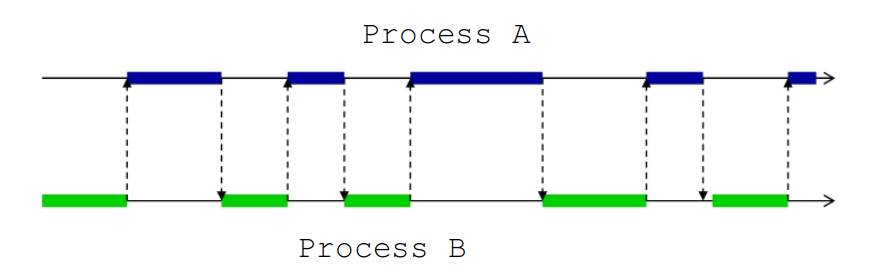

## Objectives
- What is concurrency
- Sequential vs concurrent programs
- Applications of concurrency

## Parallelism vs Concurrency
- System said to be concurrent *if it can support two or more actions in progress at a time*
- System said to be parallel *if it can support two or more actions executing simultaneously*

## Concurrency Examples
- Building a house:
  - Some work can go in parallel with other work
- Railway Network:
  - Multiple trains moving together in a network

## Concurrent Programs
- Programs where several processes are executing simultaneously:
    - Multiple machines doing things at the same time
    - Multiple processes doing things at the same time
    - Individual processes doing multiple things at the same time (multiple threads)
- All programming and execution activities that involve multiple streams of execution being implemented to solve a single problem
- Required to think about multiple execution streams running at the same time
- Coordinating all those streams in order to complete a given computation

## Granularity
- Amount of computation within a task is called the granularity
- Higher granularity means more computation
- Course-grained meaning high granularity
- Fine-grained meaning low granularity

<i>
Figure: Granularity Decomposition
</i>

- The fine-grained solution will take longer to run than the course-grained solution
- This is because of the overhead introduced from having too many tasks
- Larger tasks provide other performance benifits:
  - Reuse of cache
  - More efficient memory access patterns

## Dependencies
- A dependence is an ordering relationship between two computations
  - For correct result the ordering must be observed
- e.g
  - One process waiting for data from another process
  - Two threads/processes reading/writing the same memory locations
- Order dependency
  - Happens when some task relies on the completed results of the computations from another task
- Data dependency
  - For example, assignment: `x = x + 1`

## Concurrent Processing
- Multiple processes appear to be executing concurrently on a machine by timesharing resources
- When several processes are executed on a single processor, they are not running in true parallel

## Concurrent Programs
- A concurrent program is one consisting of two or more processes
- Each process itself does something different
- Concurrent processes which constitute a concurrent program must cooperate with each other

### Process Cooperation
- Synchronisation is needed for concurrent processes
- To cooperate, the processes in a concurrent program must communicate with each other:
  - Using shared variables
  - Message passing
- Main problem in concurrent programming is synchronising this communication

### Competing Process
- Similar problems occur with functionally independent processes which do not cooperate:
  - They compete for resources
  - They need to synchronise their actions; two programs cannot use a printer at the same time
- Synchronisation is handled by the OS

### Interprocess Communication 
- Shared memory
- Message passing

### Atomic Operations
- Operations that cannot be divided any smaller
- Cannot be preempted

## Interleaving
- The processor executes a sequence of instructions which is an interleave of the instruction sequences from several processes
- Does not affect the order in which instructions are executed by each process

## Concurrency
- Suppose we have an expression:
  - `(a * b + c * d ^ 2) * (g + f * h)`
- There may be some interdependencies in the sub-expression within the whole expression
- We can decompose our concurrent programming problem into a set of sequential programs together with some controller interaction between them
- No thread's statements may be unfairly excluded from any arbitrary interleaving

<i>
Figure: Concurrent Execution with One Processor
</i>
- Opeartions of a process consist of multiple atomic operations
- Process switches can occur between any of those atomic operations

## Interference
- Interference occurs when two processes read and write shared variables in an unpredictable order
- To solve this, mutual exclusion is required:
  - Some way of making sure that if one process is using a shared variable, the other process will be locked from doing so