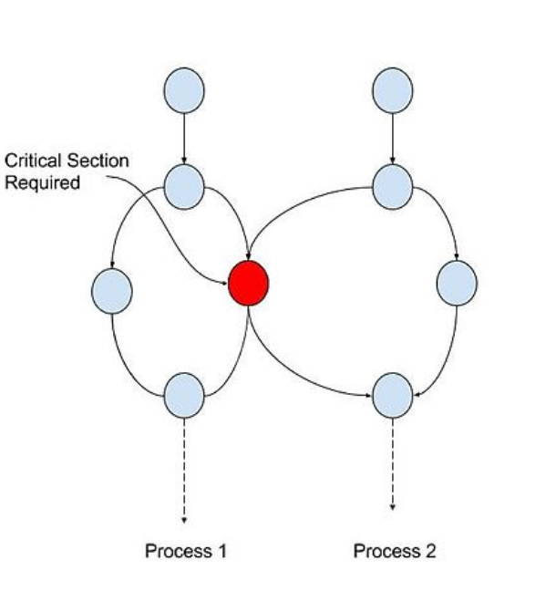
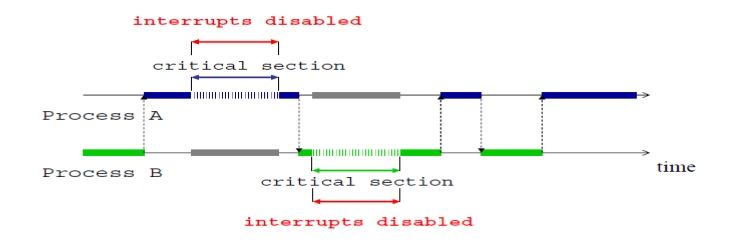
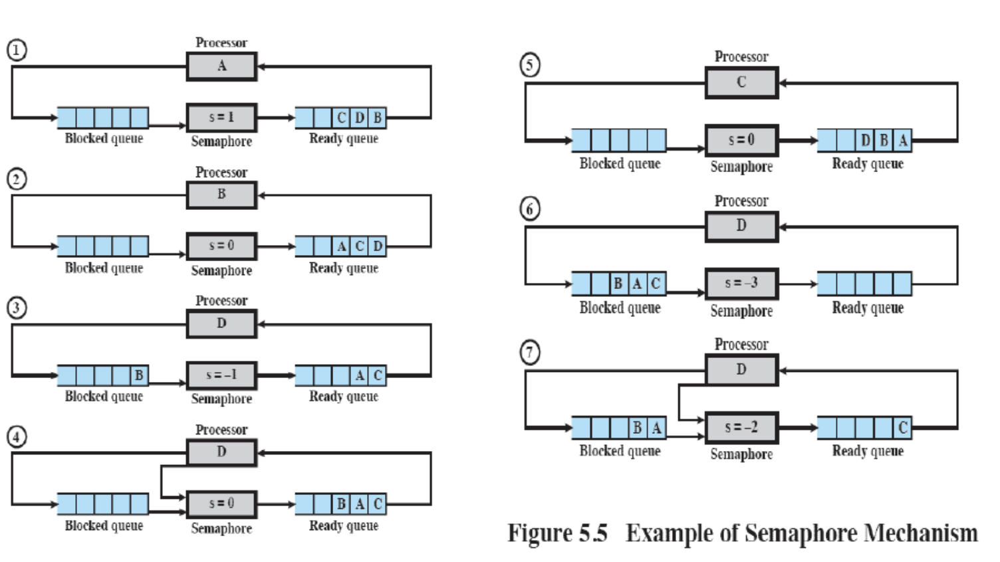

## Objectives
- Principles of Concurrency
- Difficulties of Concurrency
- Race Condition
- Mutual Exclusions
- Peterson's Algorithm

## Race Condition
- Occurs when there is an uncoordinated concurrent access to shard resources
- Situation where several processes access and manipulate data concurrently
- Leads to incorrect behaviour, deadlock or lost of work
- Final value of the shared data depends upon which process finishes last
- Three problems:
  - Need for mutual exclusion
  - Deadlock
  - Starvation

## Critical Section
- In concurrent programming, concurrent accesses to shared resources can lead to unexpected or erroneous behavior, so parts of the program where the shared resource is accessed need to be protected in ways that avoid the concurrent access
- This protected section is the critical section or critical region
- It cannot be executed by more than one process at a time
- Typically, the critical section accesses a shared resource, such as a data structure, a peripheral device, or a network connection, that would not operate correctly in the context of multiple concurrent accesses


<i><p style="text-align: center;">Figure: Critical Section</p></i>

## Mutual Exclusion Requirements
- No two processes simultaneously in critical region
- No assumptions made about speeds or numbers of CPUs
- No processes running outside its critial region may block another process
- No process must wait forever to enter its critical region
- Solution should be implemented in software

### Busy Waiting
- If the process is not allowed to enter its critical section, it sits in a tight loop waiting for a condition to be met
- Reduces CPU utilization
- Most efficient solution when waits are certain to be short
- Advantage:
  - Thread has the processor and can resume immediately after the wait is finished
- Disadvantages:
  - OS must allow it
  - One process could take all of the CPU time if it does not turn them on again
  - May not work in a multi-processor system

### Multual Exclusion with Busy Waiting
- https://modern-os.blogspot.com/2011/11/mutual-exclusion-with-busy-waiting.html
#### Disabling Interrupts
- When a process tries to enter its critical region, disable interrupts from all other processes
- By doing this, the CPU is unable to switch to other processes
- Uses *busy waiting*
- The overhead required to disable (and later re-enable) interrupts is negligible
- Disabling interrupts during the execution of a long critical section can significantly degrade system response time


<i><p style="text-align: center;">Figure: Disabling Interrupts</p></i>
### Mutual Exclusion with Hardware
- Special Machine Instruction
  - Performed in a single instruction cycle
- In uniprocessor systems they are executed without any interrupt
- In multiprocessor systems they are executed with locked system bus
- Disadvantages:
  - Busy-waiting is employed, thus while a process is waiting for access to a critical section it continues to waste CPU cycles
  - Starvation is possible when a process leaves a critical section and more than one process is waiting
  - Deadlock is possibles

#### Locking Variables
- Flawed
- When a process is in its critical section, lock variables so that it cannot be used by other processes

#### Peterson's Algorithm
``` C
// assume two processes: 0 and 1
int No_Of_Processes;
int turn;
int interested[]; // All values initially FALSE, size is no of processes

void enter_region(int process) {
    int other;

    other = 1 - process;
    interested[process] = TRUE;
    turn = other;
    while (turn == other && interested[other] == TRUE); // wait
}

void leave_region(int process) {
    interested[process] = FALSE;
}

```
- Initially, the array interested has all (both) its elements to set to false
- Assume process 0 calls enter_region
- The variable other is 1
- When a process calls enter_region, it sets the turn and interest

|turn == other|Interested[1]|Status|
|:-:|:-:|:-:|
|F|F|Continue|
|F|T|Continue|
|T|F|Continue|
|T|T|Wait|

#### Peterson's Solution
- Enforces mutual exclusion
- Uses *busy waiting*
- Uses only simple shared variables (does not use special instructions such as Test-and-Set)
- A interested value of 1 indicates that the process wants to enter the critical section
- A variable turn holds the ID of the process next in line
- Entrance to the critical section is granted for process 0 if process 1 does not want to enter its critical section or if process 1 has given priority to process 0 by setting turn to 1
- Properties:
  - Mutual Exclusion
  - Absence of deadlock
    - turn can only be 0 or 1, hence one of the while loops must be false
  - Absence of unnecessary delays
    - If P0 wants to enter its critical section and P1 does not want to, then c1 is false
    - Hence irrespective of the value of turn, P0 can enter immediately
  - Eventual entry is guaranteeed even if scheduling policy is only weakly fair
    - If both P0 and P1 want to enter their critical sections, then c0 and c1 are true and turn is either 0 or 1
    - Suppose turn is 0, then P0 will enter its critical section
    - Eventually P0 will finish executing its critical section and set c0 to false
    - If P0 tries to re-enter its critical section it will set turn to 1 and P1 can run

#### Mutual Exclusion with Test-and-Set
``` C
boolean TestAndSet(boolean* lock) {
    boolean initial = *lock;
    *lock = TRUE;
    return initial;
}
```
- Code shown above not atomic, however some instruction sets include test-and-set instructions (like x86 and IBM System/360)

``` C
boolean lock = FALSE;
while(TestAndSet(*lock));

// critical section

lock = FALSE; // release from critical section

// remainder section
```
- Above code shows an example of TestAndSet being used to lock processes during critical sections
- Uses spinlock, causes *busy waiting*
  - Because the process keeps spinning in the while loop
- Suitable for short locks
- Long jobs wastes CPU cycles
- Possible starvation

#### Properties of Test and Set
- Mutual Exclusion
  - If two processes are trying to enter their critical sections, the faster one will lock their critical section
- Absence of deadlock
- Absence of livelock
-    If all processes are in their entry protocols, lock is false and hence one process will succeed in entering its critical section
- Absence of unnecessary delay
  -  If all other processes are outside their critical sections and stay there, lock is false and stays false, hence the process that is trying to enter can immediately do so
- Eventual entry is not necessarily guaranteed
  - If scheduling policy is strongly fair, a process trying to enter its critical section will eventually succeed, because lock becomes false eventually

## Semaphore
- The fundamental principle is this: Two or more processes can cooperate by means of simple signals, such that a process can be forced to stop at a specified place until it has received a specific signal
- Any complex coordination requirement can be satisfied by the appropriate structure of signals
- For signaling, special variables called semaphores are used. To transmit a signal via semaphore s, a process executes the primitive semSignal(s)
- To receive a signal via semaphore s , a process executes the primitive semWait(s); if the corresponding signal has not yet been transmitted, the process is suspended until the transmission takes place.  
- To achieve the desired effect, we can view the semaphore as a variable that has an integer value upon which only three operations are defined:
    1. A semaphore may be initialized to a nonnegative integer value.
    2. The semWait operation decrements the semaphore value. If the value becomes negative, then the process executing the semWait is blocked.
    Otherwise, the process continues execution.
    3. The semSignal operation increments the semaphore value. If the resulting value is less than or equal to zero, then a process blocked by a semWait operation, if any, is unblocked. Other than these three operations, there is no way to inspect or manipulate semaphores.
- We explain these operations as follows:
  - To begin, the semaphore has a zero or positive value
  - If the value is positive, that value equals the number of processes that can issue a wait and immediately continue to execute
  - If the value is zero, either by initialization or because a number of processes equal to the initial semaphore value have issued a wait, the next process to issue a wait is blocked, and the semaphore value goes negative
  - Each subsequent wait drives the semaphore value further into minus territory
  - The negative value equals the number of processes waiting to be unblocked
  - Each signal unblocks one of the waiting processes when the semaphore value is negative
- If a process  is waiting for a signal, it is suspended until that signal is sent
- Wait and signal operations cannot be interrutped
- Queue used to hold processes waiting on the semaphore

 <i><p style="text-align: center;">Figure: Example of Semaphore</p></i>

``` C
// Mutual Exclusion Using Semaphores
const int n = // number of processes
semaphore s = 1;
void P (int i) {
    while (TRUE) {
        semWait(s);
        /* critical section */
        semSignal(s);
        /* remainder */
    }
}
```

### Properties of Semaphores
- Mutual Exclusion
- Absence of livelock/deadlock
- Absence of unecessary delay
- Eventual entry if fair scheduling used